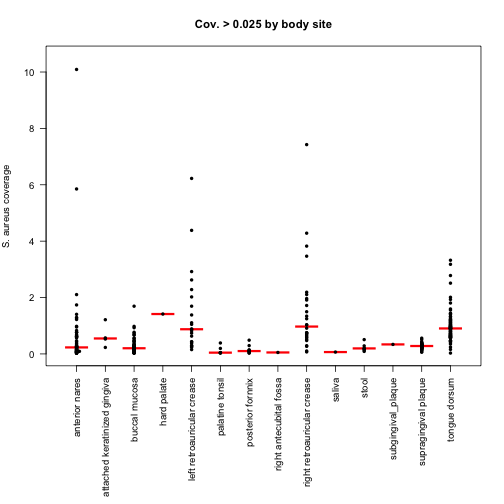
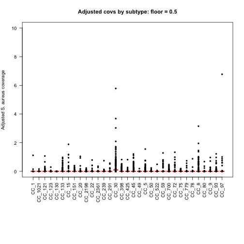
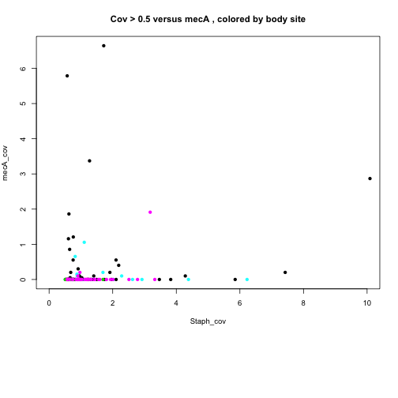
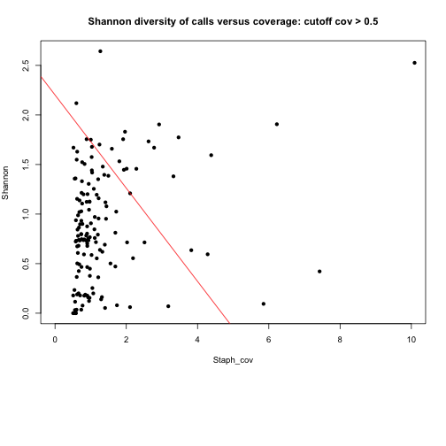
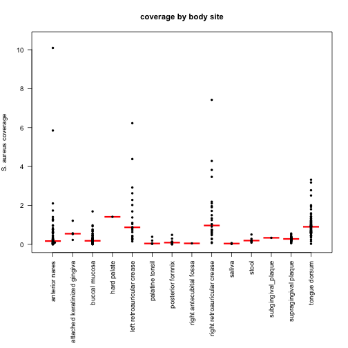
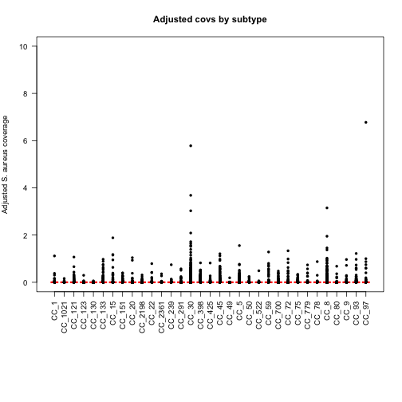
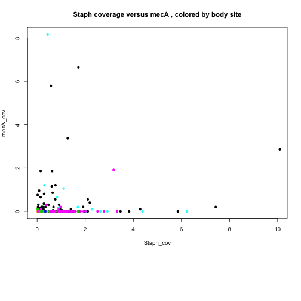
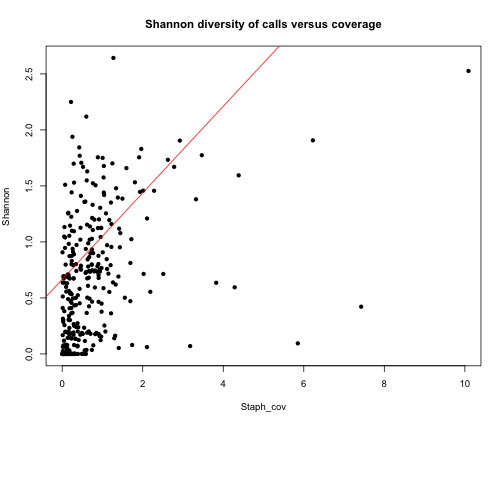

```r
print(date())
```

```
## [1] "Thu Mar  3 09:18:20 2016"
```

This workflow combines binstrain and coverage data from our Staph metagenome analysis and produces useful plots.  Also save data tables filtered at two different coverage levels for subsequent analysis in other workflows.
###Libraries

```r
library(googlesheets)
library("dplyr")
```

```
## 
## Attaching package: 'dplyr'
```

```
## The following objects are masked from 'package:stats':
## 
##     filter, lag
```

```
## The following objects are masked from 'package:base':
## 
##     intersect, setdiff, setequal, union
```

```r
library(assertthat)
library(gtools)
source('./staph_metagenome_tools.R')
```

###Download the coverage data from googlesheets


```r
covs <- gs_title("Coverage_Staph_MeCA") # note: might need to register app with google here .
```

```
## Auto-refreshing stale OAuth token.
```

```
## Sheet successfully identified: "Coverage_Staph_MeCA"
```

```r
print(covs$updated)
```

```
## [1] "2015-08-05 17:41:50 GMT"
```

```r
mapping <-gs_read(covs)
```

```
## Accessing worksheet titled 'anterior_nares_MecA_Staph_Posit'.
```

```
## No encoding supplied: defaulting to UTF-8.
```

###Import the binstrain data, merge, clean and harmonize colnames

```r
dat3 <- read.csv("./Data/Final_HMP_Matrix.csv", header = TRUE, stringsAsFactors = FALSE)
colnames(dat3)[colnames(dat3) == "CC_8_72"] <- "CC_72"
dat3 <- dat3[,-(2:5)] #drop redundant cols
#merge CC_8, CC_5 and CC_30 together
dat3 <- merge_CCs(dat3,"CC_8_")
dat3 <- merge_CCs(dat3,"CC_30_")
dat3 <- merge_CCs(dat3,"CC_5_")

#clean up names and reorder
names(dat3)[names(dat3) == "MLST_93"] <- "CC_93"
dat3 <- dat3[,mixedsort(colnames(dat3))]
colnames(dat3) <- gsub("(CC_.{0,3})_.{0,4}$","\\1",colnames(dat3))
#remove missing samples
missing_samples <- c("SRS021960","SRS098620") #data consistency issue with these samples
dat4 <- filter(dat3,!(Sample.Id %in% missing_samples))


combined <- inner_join(mapping,dat4,by = c("Sample_id" = "Sample.Id"))
#remove duplicated records
combined <- combined[-c(46,95,96),]
colnames(combined)[which(colnames(combined) == "Body_Site")] <-  "Body.site"
colnames(combined)[which(colnames(combined) == "Sample_id")]  <- "Sample.Id"
combined$Body.site <- as.factor(combined$Body.site)
combined$Subject.Id <- as.factor(combined$Subject.Id)
```
#plot unflitered coverage


```r
with(mapping, plot(Staph_cov,mecA_cov, log = "x", xlim=c(0.01,20), ylim=c(0,10), ylab = "mecA coverage", xlab = "log(Staph. coverage)", pch = 16))
```


###Filter at two levels of Staph coverage and write files

```r
cov0.025 <- filter(combined, Staph_cov > 0.025)
cov0.5 <- filter(combined, Staph_cov > 0.5)
write.table(cov0.025,"./Data/cov0.025")
write.table(cov0.5,"./Data/cov0.5")
write.table(combined,"./Data/combined")
cat("Number of samples above cov > 0.025 threshold = ",nrow(cov0.025))
```

```
## Number of samples above cov > 0.025 threshold =  321
```

```r
cat("Number of samples above cov > 0.5 threshold = ",nrow(cov0.5))
```

```
## Number of samples above cov > 0.5 threshold =  149
```

###For cov > 0.025 plot the coverage at different body sites and other relationships


```r
plot_coverages(cov0.025, "Cov. > 0.025 by body site")
```



```r
plot_adjusted_coverages(cov0.025, "Adjusted covs by subtype: floor = 0.025")
```


```r
plot_mecA(cov0.025,"Cov > 0.025 versus mecA , colored by body site")
plot_diversity_vers_cov(cov0.025,"Shannon diversity of calls versus coverage: cutoff cov > 0.025")
```

```
## Loading required package: permute
```

```
## 
## Attaching package: 'permute'
```

```
## The following object is masked from 'package:gtools':
## 
##     permute
```

```
## Loading required package: lattice
```

```
## This is vegan 2.3-4
```


```
## 
## Call:
## lm(formula = Staph_cov ~ Shannon)
## 
## Residuals:
##    Min     1Q Median     3Q    Max 
## -1.276 -0.671 -0.449 -0.123 70.078 
## 
## Coefficients:
##             Estimate Std. Error t value Pr(>|t|)  
## (Intercept)   0.7332     0.3354   2.186   0.0296 *
## Shannon       0.3387     0.3959   0.855   0.3929  
## ---
## Signif. codes:  0 '***' 0.001 '**' 0.01 '*' 0.05 '.' 0.1 ' ' 1
## 
## Residual standard error: 4.05 on 319 degrees of freedom
## Multiple R-squared:  0.002289,	Adjusted R-squared:  -0.0008387 
## F-statistic: 0.7318 on 1 and 319 DF,  p-value: 0.3929
```


###Same plots for cov > 0.5 pl

```r
plot_coverages(cov0.5, "Cov. > 0.5 by body site")
```


```r
plot_adjusted_coverages(cov0.5, "Adjusted covs by subtype: floor = 0.5")
```



```r
plot_mecA(cov0.5,"Cov > 0.5 versus mecA , colored by body site")
```



```r
plot_diversity_vers_cov(cov0.5,"Shannon diversity of calls versus coverage: cutoff cov > 0.5")
```

```
## 
## Call:
## lm(formula = Staph_cov ~ Shannon)
## 
## Residuals:
##    Min     1Q Median     3Q    Max 
## -1.693 -1.123 -0.839 -0.355 68.712 
## 
## Coefficients:
##             Estimate Std. Error t value Pr(>|t|)  
## (Intercept)   2.2005     0.8675   2.537   0.0122 *
## Shannon      -0.4699     0.8406  -0.559   0.5770  
## ---
## Signif. codes:  0 '***' 0.001 '**' 0.01 '*' 0.05 '.' 0.1 ' ' 1
## 
## Residual standard error: 5.85 on 147 degrees of freedom
## Multiple R-squared:  0.002121,	Adjusted R-squared:  -0.004667 
## F-statistic: 0.3125 on 1 and 147 DF,  p-value: 0.577
```



###Same plots for all data

```r
plot_coverages(combined, "coverage by body site")
```



```r
plot_adjusted_coverages(combined, "Adjusted covs by subtype")
```



```r
plot_mecA(combined,"Staph coverage versus mecA , colored by body site")
```



```r
plot_diversity_vers_cov(combined,"Shannon diversity of calls versus coverage")
```

```
## 
## Call:
## lm(formula = Staph_cov ~ Shannon)
## 
## Residuals:
##    Min     1Q Median     3Q    Max 
## -1.315 -0.638 -0.440 -0.096 70.140 
## 
## Coefficients:
##             Estimate Std. Error t value Pr(>|t|)  
## (Intercept)   0.6651     0.3134   2.122   0.0346 *
## Shannon       0.3865     0.3782   1.022   0.3075  
## ---
## Signif. codes:  0 '***' 0.001 '**' 0.01 '*' 0.05 '.' 0.1 ' ' 1
## 
## Residual standard error: 3.95 on 336 degrees of freedom
## Multiple R-squared:  0.003099,	Adjusted R-squared:  0.0001321 
## F-statistic: 1.045 on 1 and 336 DF,  p-value: 0.3075
```



###Session info

```r
sessionInfo()
```

```
## R version 3.2.3 (2015-12-10)
## Platform: x86_64-apple-darwin13.4.0 (64-bit)
## Running under: OS X 10.11.3 (El Capitan)
## 
## locale:
## [1] en_US.UTF-8/en_US.UTF-8/en_US.UTF-8/C/en_US.UTF-8/en_US.UTF-8
## 
## attached base packages:
## [1] stats     graphics  grDevices utils     datasets  base     
## 
## other attached packages:
## [1] vegan_2.3-4             lattice_0.20-33         permute_0.9-0          
## [4] gtools_3.5.0            assertthat_0.1          dplyr_0.4.3            
## [7] googlesheets_0.1.0.9001 knitr_1.12.3           
## 
## loaded via a namespace (and not attached):
##  [1] Rcpp_0.12.3      cluster_2.0.3    xml2_0.1.2       magrittr_1.5    
##  [5] MASS_7.3-45      R6_2.1.2         stringr_1.0.0    httr_1.1.0      
##  [9] tools_3.2.3      parallel_3.2.3   grid_3.2.3       nlme_3.1-125    
## [13] mgcv_1.8-11      DBI_0.3.1        openssl_0.9.2    lazyeval_0.1.10 
## [17] Matrix_1.2-3     purrr_0.2.1      readr_0.2.2      formatR_1.2.1   
## [21] curl_0.9.6       evaluate_0.8     stringi_1.0-1    cellranger_1.0.0
## [25] methods_3.2.3    jsonlite_0.9.19
```
