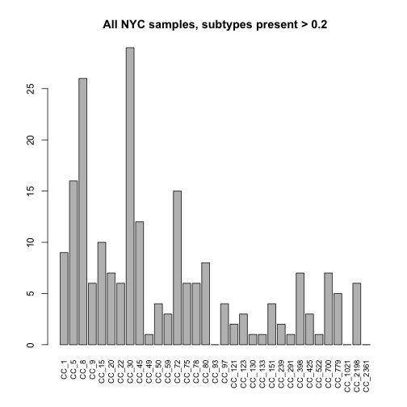
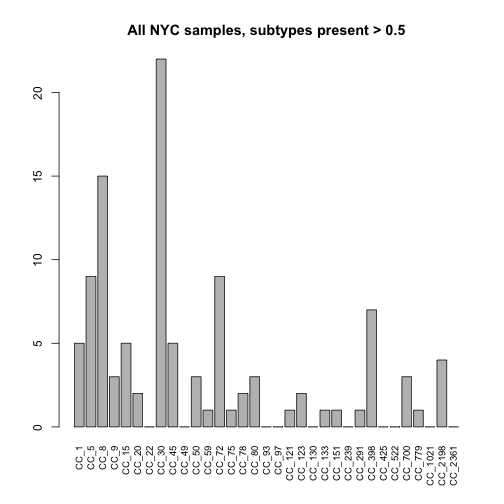
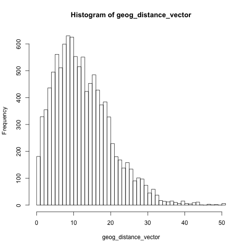
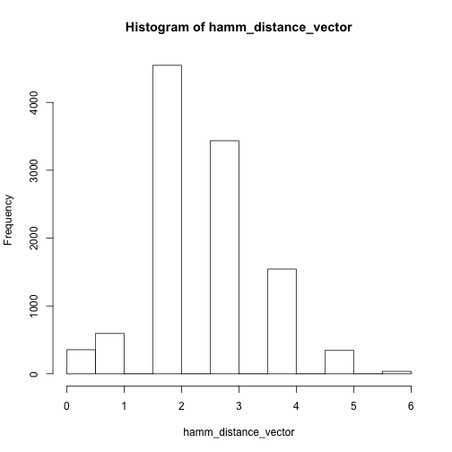
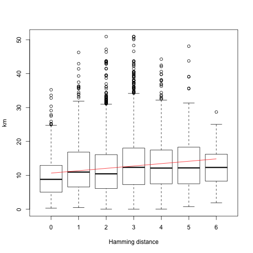

Analysis of NYC subway data.  Based on a older script called 'NYsubwaySa.R'.


```r
print(date())
```

```
## [1] "Thu Mar  3 10:33:41 2016"
```

```r
library(RgoogleMaps)
```

```
## Error in library(RgoogleMaps): there is no package called 'RgoogleMaps'
```

```r
library(dplyr)
```

```
## 
## Attaching package: 'dplyr'
```

```
## The following objects are masked from 'package:stats':
## 
##     filter, lag
```

```
## The following objects are masked from 'package:base':
## 
##     intersect, setdiff, setequal, union
```

```r
library(vegan)
```

```
## Loading required package: permute
```

```
## Loading required package: lattice
```

```
## This is vegan 2.3-4
```

```r
library(ade4)
```

```
## Error in library(ade4): there is no package called 'ade4'
```

```r
library(e1071)
library(gtools)
```

```
## 
## Attaching package: 'gtools'
```

```
## The following object is masked from 'package:e1071':
## 
##     permutations
```

```
## The following object is masked from 'package:permute':
## 
##     permute
```

```r
#library(biomod2)
library(RColorBrewer)
library(assertthat)
source('./staph_metagenome_tools.R')
```

### Load files


```r
#Public data from the original NYC subway publication: Afshinnekoo E, Meydan C, Chowdhury S, Jaroudi D, Boyer C, Bernstein N, Maritz JM, Reeves D, Gandara J, Chhangawala S, Ahsanuddin S, Simmons A, Nessel T, Sundaresh B, Pereira E, Jorgensen E, Kolokotronis S-O, Kirchberger N, Garcia I, Gandara D, Dhanraj S, Nawrin T, Saletore Y, Alexander N, Vijay P, Hénaff EM, Zumbo P, Walsh M, O’Mullan GD, Tighe S, Dudley JT, Dunaif A, Ennis S, O’Halloran E, Magalhaes TR, Boone B, Jones AL, Muth TR, Paolantonio KS, Alter E, Schadt EE, Garbarino J, Prill RJ, Carlton JM, Levy S, Mason CE. Geospatial Resolution of Human and Bacterial Diversity with City-Scale Metagenomics. Cell Systems [Internet]. Elsevier; 2015 Jul 29;1(1):72–87.
NYCdata <- (read.csv("./Data/DataTable5-metaphlan-metadata_v19.csv",stringsAsFactors = FALSE, header = TRUE))[1:4]
# we made this table from parsing the SRA
strain_SRA <- read.table("./Data/runs-to-samples.txt", header = TRUE)
colnames(strain_SRA) <- c("Run", "Sample.ID") #to make join easier
NYCdata_SRA <- left_join(NYCdata, strain_SRA, by = "Sample.ID")
```

```
## Warning in left_join_impl(x, y, by$x, by$y): joining factor and character
## vector, coercing into character vector
```


```r
#Our table of binstrain results
# Staph_betas <- read.csv("./Data/Final_Beta_NYC_STAPH.csv",stringsAsFactors = FALSE, header = TRUE)
# #remove the final row, which is actually a bead wash control (suggests some carrover contamination)
# Staph_betas <- Staph_betas[-130,]
```

### import CC, merge CC, rename and tidy, create various forms of the data to be fed into funciotns 
(reflects the piecemeal development of the fucnitons over several months with changing specs)

(Note used some similar commands in HMP_coverage.Rmd).  Need to merge becasue we originally separated CC30, CC8 and CC5 into multiple groups but this turned out not to be specific.


```r
Staph_betas <- read.csv("./Data/FInal_NYC_Staph_MecA_Table.csv", stringsAsFactors = FALSE, header = TRUE) %>% filter(Staph_Coverage > 0.025) %>% filter(!(Sample.Id == "SRR1750088")) 
colnames(Staph_betas)[colnames(Staph_betas) == "CC_8_72"] <- "CC_72"
Staph_betas <- merge_CCs(Staph_betas,"CC_8_")
Staph_betas <- merge_CCs(Staph_betas,"CC_30_")
Staph_betas <- merge_CCs(Staph_betas,"CC_5_")

names(Staph_betas)[names(Staph_betas) == "MLST_93"] <- "CC_93"
Staph_betas <- Staph_betas[,mixedsort(colnames(Staph_betas))]
colnames(Staph_betas) <- gsub("(CC_.{0,3})_.{0,4}$","\\1",colnames(Staph_betas))
colnames(Staph_betas)[colnames(Staph_betas) == "Sample.Id"] <- "Run"
#remove SRR1748847, which has an incorrect coord
Staph_betas <- filter(Staph_betas, Run != "SRR1748847")
staph_mat <- make_subtype_matrix(Staph_betas)

staph_df <- as.data.frame(staph_mat)
staph_df <- cbind(staph_df,Staph_betas$Run)
colnames(staph_df)[colnames(staph_df) == "Staph_betas$Run"] <- "Run"
staph_df$Run <- as.factor(staph_df$Run)
staph_df_coords <- inner_join(NYCdata_SRA, staph_df, by = "Run") #one of the samples does not have a lat , lon posiiotn
```

```
## Warning in inner_join_impl(x, y, by$x, by$y): joining factors with
## different levels, coercing to character vector
```

```r
coords_df_subtype_mat <- make_subtype_matrix(staph_df_coords)
```

#Subtype abundance

```r
colSums(staph_mat > 0.2) %>% sort
```

```
##   CC_93 CC_1021 CC_2361   CC_49  CC_130  CC_133  CC_291  CC_522  CC_121 
##       0       0       0       1       1       1       1       1       2 
##  CC_239   CC_59  CC_123  CC_425   CC_50   CC_97  CC_151  CC_779    CC_9 
##       2       3       3       3       4       4       4       5       6 
##   CC_22   CC_75   CC_78 CC_2198   CC_20  CC_398  CC_700   CC_80    CC_1 
##       6       6       6       6       7       7       7       8       9 
##   CC_15   CC_45   CC_72    CC_5    CC_8   CC_30 
##      10      12      15      16      26      29
```


### genotype plots


```r
presence_mat <- as.data.frame(bintr(staph_mat,0.2))
top_score_mat <- as.data.frame(bintr(staph_mat,0.5))
# png("~/Dropbox/ARTICLES_BY_TDR/2015-staph-metagenome/HMP_barchart.png",width=640, height =640, res = 75)
# dev.off()
all_genotypes_plot(presence_mat,"All NYC samples, subtypes present > 0.2")
```



```r
all_genotypes_plot(top_score_mat,"All NYC samples, subtypes present > 0.5")
```



### Color stations reporting S. aureus

```r
locations_with_runs <- filter(NYCdata_SRA, !is.na(Run) ) %>%
  select(Latitude, Logitude)

lats <- as.numeric(as.character(locations_with_runs$Latitude))
```

```
## Warning: NAs introduced by coercion
```

```r
lons <- as.numeric(as.character(locations_with_runs$Logitude))
```

```
## Warning: NAs introduced by coercion
```

```r
cols_staph <- rep(NULL,length(lats))
#all the statiitons which had S. aureus
cols_staph[which(NYCdata_SRA$Run %in% Staph_betas$Run)] <- "red"

alllats <- as.numeric(as.character(NYCdata$Latitude)) #every non-numeric value is converted to NA
```

```
## Warning: NAs introduced by coercion
```

```r
alllons <- as.numeric(as.character(NYCdata$Logitude))
```

```
## Warning: NAs introduced by coercion
```
### Generate google maps

```r
gmap1 <- GetMap(center = c(lat = 40.7127, lon = -74.0059), size = c(640, 640), zoom = 11, GRAYSCALE = TRUE)
```

```
## Error in eval(expr, envir, enclos): could not find function "GetMap"
```

```r
#centered on Queens
gmap2 <- GetMap(center = c(lat = 40.7500, lon = -73.8667), size = c(640, 640), zoom = 11, GRAYSCALE = TRUE)
```

```
## Error in eval(expr, envir, enclos): could not find function "GetMap"
```

```r
gmap3 <- GetMap(center = c(lat = 40.7500, lon = -73.8667), size = c(640, 640), zoom = 10, GRAYSCALE = TRUE)
```

```
## Error in eval(expr, envir, enclos): could not find function "GetMap"
```
### Make plots of overall coverage
 

```r
png("./NYC_subway_plots/all_stations_z11.png",width=640, height =640, res = 75)
PlotOnStaticMap(gmap2, lat = lats , lon = lons, cex=1.5,pch=20, col = "blue")
```

```
## Error in eval(expr, envir, enclos): could not find function "PlotOnStaticMap"
```

```r
dev.off()
```

```
## quartz_off_screen 
##                 2
```

```r
png("./NYC_subway_plots/all_stations_z10.png",width=640, height =640, res = 75)
PlotOnStaticMap(gmap3, lat = lats , lon = lons, cex=1.5,pch=20, col = "blue")
```

```
## Error in eval(expr, envir, enclos): could not find function "PlotOnStaticMap"
```

```r
dev.off()
```

```
## quartz_off_screen 
##                 2
```

```r
png("./NYC_subway_plots/all_staph_z11.png",width=640, height =640, res = 75)
PlotOnStaticMap(gmap2, lat = lats , lon = lons, cex=1.5,pch=20, col = cols_staph)
```

```
## Error in eval(expr, envir, enclos): could not find function "PlotOnStaticMap"
```

```r
dev.off()
```

```
## quartz_off_screen 
##                 2
```

```r
png("./NYC_subway_plots/all_staph_z10.png",width=640, height =640, res = 75)
PlotOnStaticMap(gmap3, lat = lats , lon = lons, cex=1.5,pch=20, col = cols_staph)
```

```
## Error in eval(expr, envir, enclos): could not find function "PlotOnStaticMap"
```

```r
dev.off()
```

```
## quartz_off_screen 
##                 2
```

### PLot each CC type


```r
for (i in colnames(staph_df)[1:33]){
    plot_CC_types(CC = i, mat = staph_df, map10 = gmap3, map11 = gmap2, plotdir = "./NYC_subway_plots/", SRA_file = staph_df_coords)

}
```

```
## Error in library(RgoogleMaps): there is no package called 'RgoogleMaps'
```
### Mantel test for spatial autocorrelation of Staph aureus genotypes


```r
##First get Bray curtis matrix of dissimilarities
# braymat <- vegdist(staph_mat)
# jacmat <- vegdist(staph_mat, method = "jaccard")
# ##now get geographical distance
# 
# points_staph <- inner_join(NYCdata_SRA, Staph_betas, by = "Run") %>% select(Logitude,Latitude) 
# points_staph <- points_staph[-32,]#row 32 is mislabeled
# geogdist_staph <- dist(points_staph)
# set.seed(45678)
# mantel.rtest(geogdist_staph,braymat,nrepet = 9999)
# 
# mantel.rtest(geogdist_staph,jacmat,nrepet = 9999)
# 
```

### calculate hamming distances as an alternative using e1071 function


```r
binmat <- bintr(coords_df_subtype_mat,0.2)
#hammmingmat <- hamming.distance(binmat)
bin_df <- as.data.frame(cbind(staph_df_coords$Run,binmat))
colnames(bin_df)[1] <- "Run"
# mantel.rtest(geogdist_staph,hammmingmat,nrepet = 9999)
run_geog <- select(staph_df_coords,Run, Latitude, Logitude)
combs <- combinations(r=2,v=run_geog$Run, n = length(run_geog$Run))
geog_distance_vector <- sapply(1:nrow(combs), function(x) dist_between_stations(combs[x,],run_geog))
hamm_distance_vector <- sapply(1:nrow(combs), function(x) H_distance_between_stations(combs[x,],bin_df))
#some were taken from the same location - need to filter these out
zero_stations <- which(geog_distance_vector == 0)
geog_distance_vector <- geog_distance_vector[-(zero_stations)]
hamm_distance_vector <- hamm_distance_vector[-(zero_stations)]
hist(geog_distance_vector, breaks = 50)
```



```r
hist(hamm_distance_vector)
```



```r
boxplot(geog_distance_vector ~ hamm_distance_vector, xlab = "Hamming distance", ylab = "km")
#try regression
reg <- lm(geog_distance_vector ~ as.numeric(hamm_distance_vector))
segments(x0=1,x1=7,y0=reg$coefficients[1],y1=reg$coefficients[1]+(reg$coefficients[2]*6), col = "red")
```



```r
summary(reg)
```

```
## 
## Call:
## lm(formula = geog_distance_vector ~ as.numeric(hamm_distance_vector))
## 
## Residuals:
##     Min      1Q  Median      3Q     Max 
## -13.437  -5.720  -1.127   4.509  38.864 
## 
## Coefficients:
##                                  Estimate Std. Error t value Pr(>|t|)    
## (Intercept)                       10.6695     0.1981  53.849   <2e-16 ***
## as.numeric(hamm_distance_vector)   0.6976     0.0711   9.811   <2e-16 ***
## ---
## Signif. codes:  0 '***' 0.001 '**' 0.01 '*' 0.05 '.' 0.1 ' ' 1
## 
## Residual standard error: 7.637 on 10855 degrees of freedom
## Multiple R-squared:  0.00879,	Adjusted R-squared:  0.008699 
## F-statistic: 96.26 on 1 and 10855 DF,  p-value: < 2.2e-16
```

#functions for looking at geog distance of individual subtypes by permutation

```r
CC_geog_perm_test(SRA_file = staph_df_coords, CC = "CC_8", cutoff = 0.2, s = 345, reps= 1000)
```

```
## Av geog. distance of  CC_8  =  6.05981 
## Quartile of random distribution of dists  0.024
```

```r
CC_geog_perm_test(SRA_file = staph_df_coords, CC = "CC_30", cutoff = 0.2, s = 4564, reps= 1000)
```

```
## Av geog. distance of  CC_30  =  7.819078 
## Quartile of random distribution of dists  0.268
```

```r
CC_geog_perm_test(SRA_file = staph_df_coords, CC = "CC_5", cutoff = 0.2, s = 23, reps= 1000)
```

```
## Av geog. distance of  CC_5  =  10.42825 
## Quartile of random distribution of dists  0.823
```

```r
CC_geog_perm_test(SRA_file = staph_df_coords, CC = "CC_45", cutoff = 0.2, s = 455, reps= 1000)
```

```
## Av geog. distance of  CC_45  =  8.472947 
## Quartile of random distribution of dists  0.492
```

```r
CC_geog_perm_test(SRA_file = staph_df_coords, CC = "CC_15", cutoff = 0.2, s = 989, reps= 1000)
```

```
## Av geog. distance of  CC_15  =  7.433129 
## Quartile of random distribution of dists  0.317
```

```r
CC_geog_perm_test(SRA_file = staph_df_coords, CC = "CC_1", cutoff = 0.2, s = 467856765, reps= 1000)
```

```
## Av geog. distance of  CC_1  =  8.040803 
## Quartile of random distribution of dists  0.424
```


### session info


```r
sessionInfo()
```

```
## R version 3.2.3 (2015-12-10)
## Platform: x86_64-apple-darwin13.4.0 (64-bit)
## Running under: OS X 10.11.3 (El Capitan)
## 
## locale:
## [1] en_US.UTF-8/en_US.UTF-8/en_US.UTF-8/C/en_US.UTF-8/en_US.UTF-8
## 
## attached base packages:
## [1] stats     graphics  grDevices utils     datasets  base     
## 
## other attached packages:
## [1] assertthat_0.1     RColorBrewer_1.1-2 gtools_3.5.0      
## [4] e1071_1.6-7        vegan_2.3-4        lattice_0.20-33   
## [7] permute_0.9-0      dplyr_0.4.3        knitr_1.12.3      
## 
## loaded via a namespace (and not attached):
##  [1] Rcpp_0.12.3     class_7.3-14    MASS_7.3-45     grid_3.2.3     
##  [5] R6_2.1.2        nlme_3.1-125    DBI_0.3.1       formatR_1.2.1  
##  [9] magrittr_1.5    evaluate_0.8    stringi_1.0-1   lazyeval_0.1.10
## [13] Matrix_1.2-3    tools_3.2.3     stringr_1.0.0   parallel_3.2.3 
## [17] cluster_2.0.3   mgcv_1.8-11     methods_3.2.3
```


