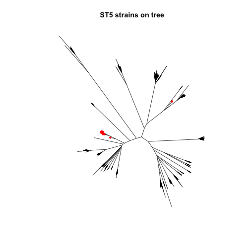
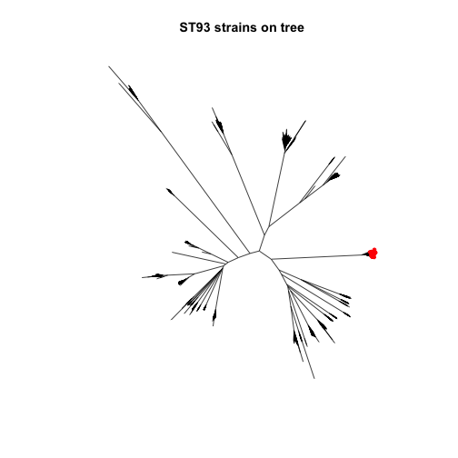
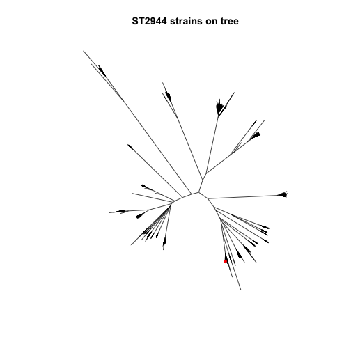

```r
library(phangorn)
```

```
## Loading required package: ape
```

```r
library(dplyr)
```

```
## 
## Attaching package: 'dplyr'
```

```
## The following objects are masked from 'package:stats':
## 
##     filter, lag
```

```
## The following objects are masked from 'package:base':
## 
##     intersect, setdiff, setequal, union
```

```r
source('./staph_metagenome_tools.R')
```


```r
STstrains <- read.csv("./Data/S2_Data.csv", header = TRUE, stringsAsFactors = FALSE)
```

Load tree


```r
load("~/dm")
NJ <- nj(dm)
```
 Find and label ST5 tips
 


```r
plotST <- function(ST){
  strains <- filter(STstrains, MLST.type == ST) %>% select(SRA.id)
  tips2label <- which(NJ$tip.label %in% strains[,"SRA.id"])
  tit <- paste("ST",ST," strains on tree",sep = "")
  plot(NJ, "unrooted", show.tip.label = FALSE, main = tit)
  tiplabels(tip = tips2label, pch= 20, col = "red")
}
```


```r
MLST_vec <- select(STstrains,MLST.type) %>% unique() 
```


```r
for(i in MLST_vec[,"MLST.type"]){
  plotST(i)
}
```




