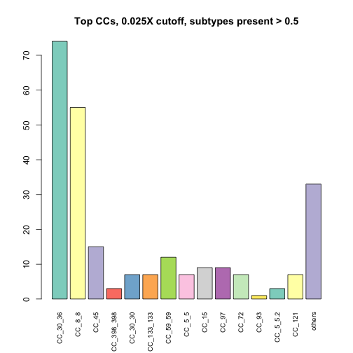
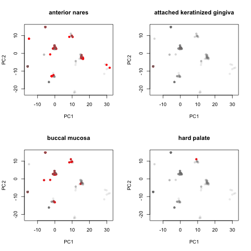
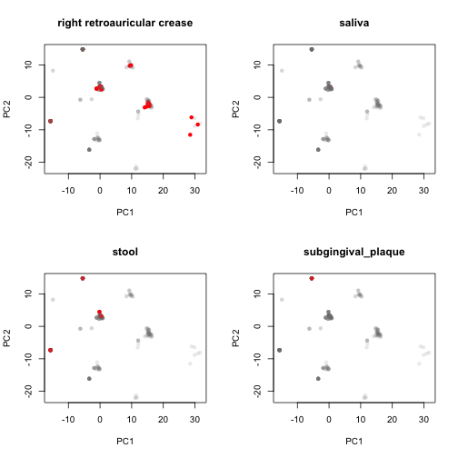
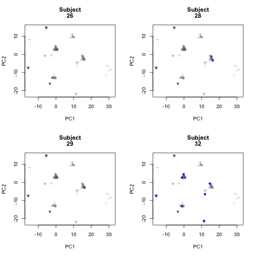
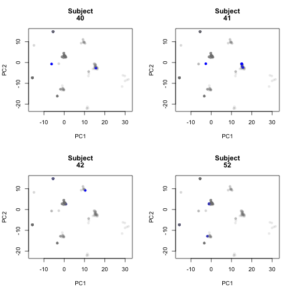
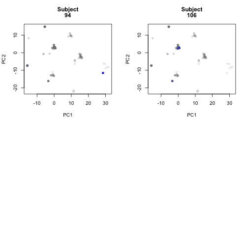

Starting form the filtered table from 'HMP_coverage.Rmd'.  Run a series of analysis to look at relationships between body site and subjects.


```r
print(date())
```

```
## [1] "Wed Mar  2 17:58:26 2016"
```

```r
library(reshape2)
#library(igraph)
library(dplyr)
```

```
## 
## Attaching package: 'dplyr'
```

```
## The following objects are masked from 'package:stats':
## 
##     filter, lag
```

```
## The following objects are masked from 'package:base':
## 
##     intersect, setdiff, setequal, union
```

```r
#library(biomod2)
library(e1071)
library(RColorBrewer)
library(gdata)
```

```
## gdata: read.xls support for 'XLS' (Excel 97-2004) files ENABLED.
```

```
## 
```

```
## gdata: read.xls support for 'XLSX' (Excel 2007+) files ENABLED.
```

```
## 
## Attaching package: 'gdata'
```

```
## The following objects are masked from 'package:dplyr':
## 
##     combine, first, last
```

```
## The following object is masked from 'package:stats':
## 
##     nobs
```

```
## The following object is masked from 'package:utils':
## 
##     object.size
```

```r
library(vegan)
```

```
## Loading required package: permute
```

```
## Loading required package: lattice
```

```
## This is vegan 2.3-4
```

```r
library(assertthat)
source('./staph_metagenome_tools.R', echo=TRUE)
```

```
## 
## > bintr <- function(mat, cutoff) {
## +     mat[which(mat > cutoff)] <- 1
## +     mat[which(!(mat > cutoff))] <- 0
## +     return(mat)
## + }
## 
## > calc_FTS <- function(pop, mini) {
## +     fishmat <- matrix(c(mini[1], mini[2], pop[1] - mini[1], pop[2] - 
## +         mini[2]), ncol = 2, nrow = 2)
## +  .... [TRUNCATED] 
## 
## > calc_hits <- function(nameset, mat) {
## +     minimat <- select(mat, one_of(nameset))[rownames(mat) %in% 
## +         nameset, ]
## +     minimat.size <- ( .... [TRUNCATED] 
## 
## > calc_hits_slice <- function(nameset, mat) {
## +     minimat <- slice(mat, nameset)[, nameset]
## +     minimat.hits <- sum(minimat)/2
## +     return(minima .... [TRUNCATED] 
## 
## > create_cooccur_mat <- function(mat) {
## +     library(reshape2)
## +     dat2 <- melt(mat)
## +     w <- dcast(dat2, V2 ~ V1)
## +     x <- as.matrix(w[, -1])
##  .... [TRUNCATED] 
## 
## > genotypes_plot <- function(mat, tit, top_genos) {
## +     if (length(top_genos) == 0) {
## +         top_genos <- c("CC_30", "CC_8", "CC_45", "CC_398", " ..." ... [TRUNCATED] 
## 
## > all_genotypes_plot <- function(mat, tit) {
## +     cS <- colSums(mat)
## +     barplot(cS, main = tit, las = 3, cex.names = 0.8, col = "gray")
## + }
## 
## > run_bs_subj_adonis <- function(df, bs_vec, subj_vec) {
## +     library(e1071)
## +     library(vegan)
## +     body_site_adonis <- adonis(df ~ bs_vec)
## +     .... [TRUNCATED] 
## 
## > make_subtype_matrix <- function(df) {
## +     library(dplyr)
## +     mat <- select(df, matches("CC")) %>% as.matrix
## +     return(mat)
## + }
## 
## > plot_coverages <- function(combined.df, titl) {
## +     check_staph_df(combined.df)
## +     par(mar = c(12, 4, 4, 2), cex = 0.8)
## +     with(combined.df, .... [TRUNCATED] 
## 
## > plot_adjusted_coverages <- function(combined.df, titl) {
## +     check_staph_df(combined.df)
## +     stcols <- grep("CC|MLST", colnames(combined.df))
## +  .... [TRUNCATED] 
## 
## > plot_mecA <- function(combined.df, titl) {
## +     check_staph_df(combined.df)
## +     with(combined.df, plot(Staph_cov, mecA_cov, col = Body.site, 
## +   .... [TRUNCATED] 
## 
## > plot_diversity_vers_cov <- function(combined.df, titl) {
## +     library(vegan)
## +     check_staph_df(combined.df)
## +     stcols <- grep("CC|MLST", coln .... [TRUNCATED] 
## 
## > check_staph_df <- function(df) {
## +     library(assertthat)
## +     assert_that(length(grep("Body.site", colnames(df))) == 1)
## +     assert_that(length( .... [TRUNCATED] 
## 
## > subject_perm <- function(df, multiSubjects, hamming_mat) {
## +     library(gdata)
## +     check_staph_df(df)
## +     sub1.hits = 0
## +     sub1.cells = 0
## +  .... [TRUNCATED] 
## 
## > by_factor_perm <- function(bs, df, hamming_mat) {
## +     check_staph_df(df)
## +     for (i in bs) {
## +         bss_rows <- which(df$Body.site == i)
## +    .... [TRUNCATED] 
## 
## > intra_body_FTS <- function(body1, body2, df, multiSubjects, 
## +     u) {
## +     library(dplyr)
## +     check_staph_df(df)
## +     temp.an <- filter(df, Bo .... [TRUNCATED] 
## 
## > merge_CCs <- function(in_data, CC) {
## +     new_col <- select(in_data, matches(CC)) %>% rowSums()
## +     in_data <- select(in_data, -(matches(CC)))
## +  .... [TRUNCATED] 
## 
## > plot_CC_types <- function(CC, CCcol = "red", mat, 
## +     SRA_file, map11, map10, plotdir, cutoff = 0.2) {
## +     library(RgoogleMaps)
## +     crows <-  .... [TRUNCATED] 
## 
## > avg_geog_dist <- function(p) {
## +     mat <- as.data.frame(combinations(nrow(p), 2))
## +     dist_vec <- sapply(1:nrow(mat), function(x) distance.chord .... [TRUNCATED] 
## 
## > rand_distances <- function(n, latlon, perms = 1000) {
## +     res_vec <- replicate(perms, avg_geog_dist(sample_n(latlon, 
## +         n)), simplify = "v ..." ... [TRUNCATED] 
## 
## > distance.chord <- function(point1, point2) {
## +     R <- 6371
## +     p1rad <- point1 * pi/180
## +     p2rad <- point2 * pi/180
## +     lat <- p1rad[2]
## +   .... [TRUNCATED] 
## 
## > CC_geog_perm_test <- function(SRA_file, CC, cutoff, 
## +     s = 234523, reps = 1000) {
## +     crows <- which(SRA_file[[CC]] > cutoff)
## +     CC_df <- s .... [TRUNCATED] 
## 
## > decorate_staph_tree <- function(CC, tree, strains, 
## +     cutoff = 0.65, deco = "red") {
## +     tag_list <- filter(strains, grepl(CC, Reference.CC))  .... [TRUNCATED] 
## 
## > dist_between_stations <- function(pairs, geog.mat) {
## +     p1 <- filter(geog.mat, Run == pairs[1]) %>% select(Logitude, 
## +         Latitude) %>% t() .... [TRUNCATED] 
## 
## > H_distance_between_stations <- function(pairs, mat) {
## +     h1 <- filter(mat, Run == pairs[1])[, 2:ncol(mat)] %>% t() %>% 
## +         as.vector()
## +   .... [TRUNCATED]
```

###Read in data file created in earlier pipeline


```r
dat4 <- read.table("./Data/cov0.025")
```

###Create data files

```r
#list of all subjects with more than one sample
multiSubjects <- count(dat4,Subject.Id) %>% filter(n > 1) %>% select(Subject.Id ) 
dat5 <- make_subtype_matrix(dat4)
#create Hamming dist matrices with and without cutof  min value of 0.2
dat4$Subject.Id <- as.factor(dat4$Subject.Id)
dat6 <- make_subtype_matrix(dat4) %>% bintr(0.2) %>% hamming.distance %>% data.frame 
dat8 <- make_subtype_matrix(dat4) %>% hamming.distance %>% data.frame 
```
#Subtype abundance

```r
colSums(dat5 > 0.2) %>% sort
```

```
##   CC_49  CC_123   CC_78  CC_239  CC_522 CC_1021   CC_22  CC_130  CC_425 
##       0       0       1       1       1       1       2       2       2 
## CC_2361   CC_50   CC_80 CC_2198  CC_151  CC_779   CC_20  CC_291    CC_1 
##       2       3       3       3       4       4       5       5       6 
##    CC_9  CC_700   CC_75  CC_121   CC_72   CC_93   CC_97   CC_15   CC_59 
##       7       7       8      11      12      12      13      14      17 
##  CC_133    CC_5  CC_398   CC_45    CC_8   CC_30 
##      21      26      29      32      78     112
```


### PERMANOVA

test for significant associations of subtype with with bodysite and subject.  us e Hamming dist. matrix. Two levels, one with a beta cutoff for all samples > 0.2 and one without

```r
set.seed(344098)
run_bs_subj_adonis(dat6,dat4$Body.site,dat4$Subject.Id)
```

```
## 
## Call:
## adonis(formula = df ~ bs_vec) 
## 
## Permutation: free
## Number of permutations: 999
## 
## Terms added sequentially (first to last)
## 
##            Df SumsOfSqs MeanSqs F.Model      R2 Pr(>F)    
## bs_vec     13    107.06  8.2354  2.6848 0.10208  0.001 ***
## Residuals 307    941.71  3.0674         0.89792           
## Total     320   1048.77                 1.00000           
## ---
## Signif. codes:  0 '***' 0.001 '**' 0.01 '*' 0.05 '.' 0.1 ' ' 1
## 
## 	Homogeneity of multivariate dispersions
## 
## Call: betadisper(d = dist(df), group = bs_vec)
## 
## No. of Positive Eigenvalues: 31
## No. of Negative Eigenvalues: 0
## 
## Average distance to median:
##               anterior nares attached keratinized gingiva 
##                       14.787                       10.909 
##                buccal mucosa                  hard palate 
##                       13.726                        0.000 
##   left retroauricular crease              palatine tonsil 
##                       15.135                       12.773 
##            posterior fornnix      right antecubital fossa 
##                        9.198                        0.000 
##  right retroauricular crease                       saliva 
##                       18.199                        0.000 
##                        stool           subgingival_plaque 
##                       10.353                        0.000 
##         supragingival plaque                tongue dorsum 
##                       13.614                       16.227 
## 
## Eigenvalues for PCoA axes:
##     PCoA1     PCoA2     PCoA3     PCoA4     PCoA5     PCoA6     PCoA7 
## 38212.716 28710.788  7635.598  3541.055  2363.256  1893.255  1344.076 
##     PCoA8 
##  1007.922 
##            Df   Sum Sq   Mean Sq        F N.Perm Pr(>F)
## Groups     13 1981.505 152.42350 4.794898    999  0.001
## Residuals 307 9759.126  31.78868       NA     NA     NA
## 
## Call:
## adonis(formula = df ~ subj_vec) 
## 
## Permutation: free
## Number of permutations: 999
## 
## Terms added sequentially (first to last)
## 
##            Df SumsOfSqs MeanSqs F.Model      R2 Pr(>F)    
## subj_vec  107    429.20  4.0112   1.379 0.40925  0.001 ***
## Residuals 213    619.56  2.9087         0.59075           
## Total     320   1048.77                 1.00000           
## ---
## Signif. codes:  0 '***' 0.001 '**' 0.01 '*' 0.05 '.' 0.1 ' ' 1
## 
## 	Homogeneity of multivariate dispersions
## 
## Call: betadisper(d = dist(df), group = subj_vec)
## 
## No. of Positive Eigenvalues: 31
## No. of Negative Eigenvalues: 0
## 
## Average distance to median:
##         1         2         3         4         5         6         7 
## 8.958e+00 8.062e+00 0.000e+00 0.000e+00 0.000e+00 0.000e+00 9.219e+00 
##         8         9        10        11        12        13        15 
## 2.500e+00 1.333e+01 2.318e+01 1.183e+01 1.524e+01 1.283e+01 1.698e+01 
##        16        17        18        19        20        21        22 
## 0.000e+00 0.000e+00 9.501e+00 0.000e+00 0.000e+00 8.958e+00 1.167e+01 
##        23        24        25        26        27        28        29 
## 0.000e+00 0.000e+00 1.455e+01 6.633e+00 1.169e+01 1.309e+01 1.251e+01 
##        30        31        32        33        34        35        36 
## 9.605e+00 8.958e+00 1.572e+01 1.450e+01 1.183e+01 1.239e+01 0.000e+00 
##        37        38        39        40        41        42        43 
## 1.608e+01 4.796e+00 1.477e+01 1.223e+01 1.336e+01 1.024e+01 1.119e+01 
##        44        45        46        47        48        49        50 
## 6.110e+00 0.000e+00 0.000e+00 0.000e+00 1.327e+01 0.000e+00 0.000e+00 
##        51        52        53        54        55        56        57 
## 0.000e+00 1.141e-13 0.000e+00 0.000e+00 1.419e+01 1.724e+01 1.109e+01 
##        58        60        61        62        63        64        65 
## 0.000e+00 1.502e+01 0.000e+00 0.000e+00 1.246e+01 0.000e+00 1.327e+01 
##        66        67        68        69        70        71        72 
## 1.077e+01 4.372e+00 1.374e+01 1.389e+01 1.042e+01 8.007e+00 1.693e+01 
##        73        74        75        76        77        78        79 
## 1.582e+01 6.620e+00 5.972e+00 7.681e+00 1.201e+01 8.419e+00 1.873e-14 
##        80        81        82        83        84        85        86 
## 1.074e+01 1.083e+01 8.104e-14 1.310e-13 2.981e+00 0.000e+00 1.619e+01 
##        87        88        89        90        91        92        93 
## 1.327e+01 0.000e+00 0.000e+00 0.000e+00 1.136e+01 1.150e+01 1.242e+01 
##        94        95        96        97        98        99       100 
## 1.864e+01 1.532e+01 0.000e+00 1.296e+01 0.000e+00 0.000e+00 1.167e+01 
##       101       102       103       104       105       106       107 
## 0.000e+00 1.031e+01 1.183e+01 0.000e+00 0.000e+00 1.007e+01 9.055e+00 
##       108       109       110 
## 1.327e+01 0.000e+00 8.958e+00 
## 
## Eigenvalues for PCoA axes:
##     PCoA1     PCoA2     PCoA3     PCoA4     PCoA5     PCoA6     PCoA7 
## 38212.716 28710.788  7635.598  3541.055  2363.256  1893.255  1344.076 
##     PCoA8 
##  1007.922 
##            Df    Sum Sq  Mean Sq       F N.Perm Pr(>F)
## Groups    107  9409.364 87.93799 1.14485    999   0.23
## Residuals 213 16360.917 76.81182      NA     NA     NA
## 
## Call:
## adonis(formula = df ~ bs_vec + subj_vec) 
## 
## Permutation: free
## Number of permutations: 999
## 
## Terms added sequentially (first to last)
## 
##            Df SumsOfSqs MeanSqs F.Model      R2 Pr(>F)    
## bs_vec     13    107.06  8.2354  3.0171 0.10208  0.001 ***
## subj_vec  106    393.06  3.7081  1.3585 0.37478  0.002 ** 
## Residuals 201    548.65  2.7296         0.52314           
## Total     320   1048.77                 1.00000           
## ---
## Signif. codes:  0 '***' 0.001 '**' 0.01 '*' 0.05 '.' 0.1 ' ' 1
```

```r
run_bs_subj_adonis(dat8,dat4$Body.site,dat4$Subject.Id)
```

```
## 
## Call:
## adonis(formula = df ~ bs_vec) 
## 
## Permutation: free
## Number of permutations: 999
## 
## Terms added sequentially (first to last)
## 
##            Df SumsOfSqs MeanSqs F.Model      R2 Pr(>F)   
## bs_vec     13    1126.7  86.666  2.7239 0.10341  0.008 **
## Residuals 307    9767.8  31.817         0.89659          
## Total     320   10894.5                 1.00000          
## ---
## Signif. codes:  0 '***' 0.001 '**' 0.01 '*' 0.05 '.' 0.1 ' ' 1
## 
## 	Homogeneity of multivariate dispersions
## 
## Call: betadisper(d = dist(df), group = bs_vec)
## 
## No. of Positive Eigenvalues: 273
## No. of Negative Eigenvalues: 0
## 
## Average distance to median:
##               anterior nares attached keratinized gingiva 
##                        59.25                        13.46 
##                buccal mucosa                  hard palate 
##                        15.25                         0.00 
##   left retroauricular crease              palatine tonsil 
##                        36.34                        18.84 
##            posterior fornnix      right antecubital fossa 
##                        11.70                         0.00 
##  right retroauricular crease                       saliva 
##                        30.77                         0.00 
##                        stool           subgingival_plaque 
##                        19.88                         0.00 
##         supragingival plaque                tongue dorsum 
##                        15.45                        24.87 
## 
## Eigenvalues for PCoA axes:
##      PCoA1      PCoA2      PCoA3      PCoA4      PCoA5      PCoA6 
## 887478.184  21886.524  11903.051   6700.142   3869.472   3275.460 
##      PCoA7      PCoA8 
##   2899.322   2207.445 
##            Df    Sum Sq  Mean Sq        F N.Perm Pr(>F)
## Groups     13  89135.39 6856.568 5.243688    999  0.026
## Residuals 307 401428.63 1307.585       NA     NA     NA
## 
## Call:
## adonis(formula = df ~ subj_vec) 
## 
## Permutation: free
## Number of permutations: 999
## 
## Terms added sequentially (first to last)
## 
##            Df SumsOfSqs MeanSqs F.Model      R2 Pr(>F)
## subj_vec  107    3412.0  31.888 0.90772 0.31318  0.756
## Residuals 213    7482.5  35.129         0.68682       
## Total     320   10894.5                 1.00000       
## 
## 	Homogeneity of multivariate dispersions
## 
## Call: betadisper(d = dist(df), group = subj_vec)
## 
## No. of Positive Eigenvalues: 273
## No. of Negative Eigenvalues: 0
## 
## Average distance to median:
##         1         2         3         4         5         6         7 
## 1.539e+01 2.478e+01 0.000e+00 0.000e+00 0.000e+00 0.000e+00 6.086e+01 
##         8         9        10        11        12        13        15 
## 8.194e+01 2.807e+01 4.872e+01 2.177e+01 5.367e+01 6.204e+01 2.751e+01 
##        16        17        18        19        20        21        22 
## 0.000e+00 0.000e+00 4.703e+01 0.000e+00 0.000e+00 1.135e+01 1.012e+01 
##        23        24        25        26        27        28        29 
## 0.000e+00 0.000e+00 4.029e+01 1.441e+01 3.130e+01 2.754e+01 2.075e+01 
##        30        31        32        33        34        35        36 
## 2.785e+01 1.873e+02 3.334e+01 1.780e+01 9.517e+01 3.897e+01 0.000e+00 
##        37        38        39        40        41        42        43 
## 5.415e+01 3.283e+01 4.081e+01 2.562e+01 3.258e+01 5.613e+01 1.326e+02 
##        44        45        46        47        48        49        50 
## 7.474e+01 0.000e+00 0.000e+00 0.000e+00 8.718e+00 0.000e+00 0.000e+00 
##        51        52        53        54        55        56        57 
## 0.000e+00 4.538e+01 0.000e+00 0.000e+00 2.777e+01 2.867e+01 2.996e+01 
##        58        60        61        62        63        64        65 
## 0.000e+00 2.050e+01 0.000e+00 0.000e+00 2.972e+01 0.000e+00 1.621e+01 
##        66        67        68        69        70        71        72 
## 1.766e+01 3.952e+01 1.271e+01 1.440e+01 1.878e+01 1.801e+01 1.955e+01 
##        73        74        75        76        77        78        79 
## 2.156e+01 1.389e+01 1.505e+01 2.324e+01 1.605e+01 8.174e+00 7.483e+00 
##        80        81        82        83        84        85        86 
## 1.517e+01 1.523e+01 1.265e-11 1.119e-11 2.645e+01 0.000e+00 1.301e+01 
##        87        88        89        90        91        92        93 
## 8.718e+00 0.000e+00 0.000e+00 0.000e+00 1.017e+01 3.750e+01 1.101e+01 
##        94        95        96        97        98        99       100 
## 2.281e+01 1.600e+01 0.000e+00 6.391e+01 0.000e+00 0.000e+00 1.364e+01 
##       101       102       103       104       105       106       107 
## 0.000e+00 2.131e+01 1.540e+01 0.000e+00 0.000e+00 2.302e+01 1.028e+01 
##       108       109       110 
## 8.718e+00 0.000e+00 1.497e+01 
## 
## Eigenvalues for PCoA axes:
##      PCoA1      PCoA2      PCoA3      PCoA4      PCoA5      PCoA6 
## 887478.184  21886.524  11903.051   6700.142   3869.472   3275.460 
##      PCoA7      PCoA8 
##   2899.322   2207.445 
##            Df   Sum Sq  Mean Sq        F N.Perm Pr(>F)
## Groups    107 199975.6 1868.931 1.202623    999  0.263
## Residuals 213 331011.7 1554.045       NA     NA     NA
## 
## Call:
## adonis(formula = df ~ bs_vec + subj_vec) 
## 
## Permutation: free
## Number of permutations: 999
## 
## Terms added sequentially (first to last)
## 
##            Df SumsOfSqs MeanSqs F.Model      R2 Pr(>F)   
## bs_vec     13    1126.7  86.666 2.60956 0.10341  0.005 **
## subj_vec  106    3092.5  29.174 0.87845 0.28386  0.833   
## Residuals 201    6675.4  33.211         0.61273          
## Total     320   10894.5                 1.00000          
## ---
## Signif. codes:  0 '***' 0.001 '**' 0.01 '*' 0.05 '.' 0.1 ' ' 1
```
### Permutation tests

```r
#test ffor whether intra-subject distance greater than intersubject
subject_perm(dat4,multiSubjects,dat6)
```


```
## Score for intraperson hits =  1403 
## [1] "Quartlies for random distribution"
##   0%  25%  50%  75% 100% 
## 1458 1545 1564 1583 1663 
## Empirical p value =  0
```

```r
#now look at the same test between body sites
bs <- levels(dat4$Body.site)
by_factor_perm(bs,dat4,dat6)
```

```
## [1] "anterior nares"
## [1] "Number of samples " "67"                
## [1] "Distribution of random hits"
##   0%  25%  50%  75% 100% 
## 4094 4966 5144 5326 6198 
## [1] 5144
## Empirical p value [1] 0.5004
## 
## [1] "attached keratinized gingiva"
## [1] "Number of samples " "4"                 
## [1] "Distribution of random hits"
##   0%  25%  50%  75% 100% 
##    0   12   14   16   28 
## [1] 8
## Empirical p value [1] 0.0477
## 
## [1] "buccal mucosa"
## [1] "Number of samples " "54"                
## [1] "Distribution of random hits"
##     0%    25%    50%    75%   100% 
## 2607.0 3197.0 3327.5 3459.0 4004.0 
## [1] 2725
## Empirical p value [1] 7e-04
## 
## Zero samples in  hard palate[1] "left retroauricular crease"
## [1] "Number of samples " "23"                
## [1] "Distribution of random hits"
##   0%  25%  50%  75% 100% 
##  316  550  588  626  826 
## [1] 644
## Empirical p value [1] 0.8438
## 
## [1] "palatine tonsil"
## [1] "Number of samples " "6"                 
## [1] "Distribution of random hits"
##   0%  25%  50%  75% 100% 
##    5   30   35   40   61 
## [1] 36
## Empirical p value [1] 0.5851
## 
## [1] "posterior fornnix"
## [1] "Number of samples " "9"                 
## [1] "Distribution of random hits"
##   0%  25%  50%  75% 100% 
##   16   74   84   92  138 
## [1] 48
## Empirical p value [1] 0.0074
## 
## Zero samples in  right antecubital fossa[1] "right retroauricular crease"
## [1] "Number of samples " "28"                
## [1] "Distribution of random hits"
##   0%  25%  50%  75% 100% 
##  535  828  879  929 1189 
## [1] 1091
## Empirical p value [1] 0.9979
## 
## Zero samples in  saliva[1] "stool"
## [1] "Number of samples " "7"                 
## [1] "Distribution of random hits"
##   0%  25%  50%  75% 100% 
##    6   42   48   56   84 
## [1] 30
## Empirical p value [1] 0.0314
## 
## Zero samples in  subgingival_plaque[1] "supragingival plaque"
## [1] "Number of samples " "37"                
## [1] "Distribution of random hits"
##   0%  25%  50%  75% 100% 
## 1082 1474 1552 1626 1996 
## [1] 1164
## Empirical p value [1] 7e-04
## 
## [1] "tongue dorsum"
## [1] "Number of samples " "82"                
## [1] "Distribution of random hits"
##   0%  25%  50%  75% 100% 
## 6440 7499 7732 7965 8977 
## [1] 7998
## Empirical p value [1] 0.7792
```
###Plots of subtype distribution

```r
presence_mat <- as.data.frame(bintr(dat5,0.2))
top_score_mat <- as.data.frame(bintr(dat5,0.5))
# png("~/Dropbox/ARTICLES_BY_TDR/2015-staph-metagenome/HMP_barchart.png",width=640, height =640, res = 75)
# dev.off()
genotypes_plot(presence_mat,"Top CCs, 0.025X cutff, subtypes present > 0.2")
```

```
## Error in genotypes_plot(presence_mat, "Top CCs, 0.025X cutff, subtypes present > 0.2"): argument "top_genos" is missing, with no default
```

```r
genotypes_plot(top_score_mat,"Top CCs, 0.025X cutoff, subtypes present > 0.5")
```

```
## Error in genotypes_plot(top_score_mat, "Top CCs, 0.025X cutoff, subtypes present > 0.5"): argument "top_genos" is missing, with no default
```

```r
all_genotypes_plot(presence_mat,"All CCs, 0.025X cutoff, subtypes present > 0.2")
```


```r
all_genotypes_plot(top_score_mat,"All CCs, 0.025X cutoff, subtypes present > 0.5")
```



```r
for (i in bs) {
  bss_rows <- which(dat4$Body.site == i)
  if(length(bss_rows) > 0) {
    bs_df <- slice(presence_mat,bss_rows)
    genotypes_plot(bs_df,paste(">0.2 beta: ", i))
  }
}
```

```
## Error in genotypes_plot(bs_df, paste(">0.2 beta: ", i)): argument "top_genos" is missing, with no default
```

```r
for (i in bs) {
  bss_rows <- which(dat4$Body.site == i)
  if(length(bss_rows) > 0) {
    bs_df <- slice(top_score_mat,bss_rows)
    genotypes_plot(bs_df,paste(">0.5 beta: ", i))
  }
}
```

```
## Error in genotypes_plot(bs_df, paste(">0.5 beta: ", i)): argument "top_genos" is missing, with no default
```
###PCA

```r
par(mfrow=c(2,2))
pcobj <- prcomp(dat6)
tr_gray <- rgb(0.5,.5,.5,.15)

for (i in bs) {
  prcols <- rep(tr_gray,nrow(dat6))
  prcols[which(dat4$Body.site == i)] <- "red"
  plot(pcobj$x,col = prcols, pch = 16, main = i)
}
```



```r
for (i in multiSubjects$Subject.Id) {
  sub_rows = which(dat4$Subject.Id == as.character(i))
  if (length(sub_rows) > 3){
    prcols <- rep(tr_gray,nrow(dat6))
    prcols[sub_rows] <- "blue"
    plot(pcobj$x,col = prcols, pch = 16, main = c("Subject",i))
  }
}
```


###Session Info

```r
sessionInfo()
```

```
## R version 3.2.3 (2015-12-10)
## Platform: x86_64-apple-darwin13.4.0 (64-bit)
## Running under: OS X 10.11.3 (El Capitan)
## 
## locale:
## [1] en_US.UTF-8/en_US.UTF-8/en_US.UTF-8/C/en_US.UTF-8/en_US.UTF-8
## 
## attached base packages:
## [1] stats     graphics  grDevices utils     datasets  base     
## 
## other attached packages:
##  [1] assertthat_0.1     vegan_2.3-4        lattice_0.20-33   
##  [4] permute_0.9-0      gdata_2.17.0       RColorBrewer_1.1-2
##  [7] e1071_1.6-7        dplyr_0.4.3        reshape2_1.4.1    
## [10] knitr_1.12.3      
## 
## loaded via a namespace (and not attached):
##  [1] Rcpp_0.12.3     cluster_2.0.3   magrittr_1.5    MASS_7.3-45    
##  [5] R6_2.1.2        stringr_1.0.0   plyr_1.8.3      tools_3.2.3    
##  [9] parallel_3.2.3  grid_3.2.3      nlme_3.1-125    mgcv_1.8-11    
## [13] DBI_0.3.1       class_7.3-14    gtools_3.5.0    lazyeval_0.1.10
## [17] Matrix_1.2-3    formatR_1.2.1   evaluate_0.8    stringi_1.0-1  
## [21] methods_3.2.3
```

