Starting form the filtered table from 'HMP_coverage40.Rmd'.  Run a series of analysis to look at relationships between body site and subjects.


```r
print(date())
```

```
## [1] "Thu Mar  3 17:13:00 2016"
```

```r
library(reshape2)
#library(igraph)
library(dplyr)
```

```
## 
## Attaching package: 'dplyr'
```

```
## The following objects are masked from 'package:stats':
## 
##     filter, lag
```

```
## The following objects are masked from 'package:base':
## 
##     intersect, setdiff, setequal, union
```

```r
#library(biomod2)
library(e1071)
library(RColorBrewer)
library(gdata)
```

```
## gdata: read.xls support for 'XLS' (Excel 97-2004) files ENABLED.
```

```
## 
```

```
## gdata: read.xls support for 'XLSX' (Excel 2007+) files ENABLED.
```

```
## 
## Attaching package: 'gdata'
```

```
## The following objects are masked from 'package:dplyr':
## 
##     combine, first, last
```

```
## The following object is masked from 'package:stats':
## 
##     nobs
```

```
## The following object is masked from 'package:utils':
## 
##     object.size
```

```r
library(vegan)
```

```
## Loading required package: permute
```

```
## Loading required package: lattice
```

```
## This is vegan 2.3-4
```

```r
library(assertthat)
source('./staph_metagenome_tools.R', echo=TRUE)
```

```
## 
## > bintr <- function(mat, cutoff) {
## +     mat[which(mat > cutoff)] <- 1
## +     mat[which(!(mat > cutoff))] <- 0
## +     return(mat)
## + }
## 
## > calc_FTS <- function(pop, mini) {
## +     fishmat <- matrix(c(mini[1], mini[2], pop[1] - mini[1], pop[2] - 
## +         mini[2]), ncol = 2, nrow = 2)
## +  .... [TRUNCATED] 
## 
## > calc_hits <- function(nameset, mat) {
## +     minimat <- select(mat, one_of(nameset))[rownames(mat) %in% 
## +         nameset, ]
## +     minimat.size <- ( .... [TRUNCATED] 
## 
## > calc_hits_slice <- function(nameset, mat) {
## +     minimat <- slice(mat, nameset)[, nameset]
## +     minimat.hits <- sum(minimat)/2
## +     return(minima .... [TRUNCATED] 
## 
## > create_cooccur_mat <- function(mat) {
## +     library(reshape2)
## +     dat2 <- melt(mat)
## +     w <- dcast(dat2, V2 ~ V1)
## +     x <- as.matrix(w[, -1])
##  .... [TRUNCATED] 
## 
## > genotypes_plot <- function(mat, tit, top_genos = vector()) {
## +     if (length(top_genos) == 0) {
## +         top_genos <- c("CC_30", "CC_8", "CC_45",  .... [TRUNCATED] 
## 
## > all_genotypes_plot <- function(mat, tit) {
## +     cS <- colSums(mat)
## +     barplot(cS, main = tit, las = 3, cex.names = 0.8, col = "gray")
## + }
## 
## > run_bs_subj_adonis <- function(df, bs_vec, subj_vec) {
## +     library(e1071)
## +     library(vegan)
## +     body_site_adonis <- adonis(df ~ bs_vec)
## +     .... [TRUNCATED] 
## 
## > make_subtype_matrix <- function(df) {
## +     library(dplyr)
## +     mat <- select(df, matches("CC")) %>% as.matrix
## +     return(mat)
## + }
## 
## > plot_coverages <- function(combined.df, titl) {
## +     check_staph_df(combined.df)
## +     par(mar = c(12, 4, 4, 2), cex = 0.8)
## +     with(combined.df, .... [TRUNCATED] 
## 
## > plot_adjusted_coverages <- function(combined.df, titl) {
## +     check_staph_df(combined.df)
## +     stcols <- grep("CC|MLST", colnames(combined.df))
## +  .... [TRUNCATED] 
## 
## > plot_mecA <- function(combined.df, titl) {
## +     check_staph_df(combined.df)
## +     with(combined.df, plot(Staph_cov, mecA_cov, col = Body.site, 
## +   .... [TRUNCATED] 
## 
## > plot_diversity_vers_cov <- function(combined.df, titl) {
## +     library(vegan)
## +     check_staph_df(combined.df)
## +     stcols <- grep("CC|MLST", coln .... [TRUNCATED] 
## 
## > check_staph_df <- function(df) {
## +     library(assertthat)
## +     assert_that(length(grep("Body.site", colnames(df))) == 1)
## +     assert_that(length( .... [TRUNCATED] 
## 
## > subject_perm <- function(df, multiSubjects, hamming_mat) {
## +     library(gdata)
## +     check_staph_df(df)
## +     sub1.hits = 0
## +     sub1.cells = 0
## +  .... [TRUNCATED] 
## 
## > by_factor_perm <- function(bs, df, hamming_mat) {
## +     check_staph_df(df)
## +     for (i in bs) {
## +         bss_rows <- which(df$Body.site == i)
## +    .... [TRUNCATED] 
## 
## > intra_body_FTS <- function(body1, body2, df, multiSubjects, 
## +     u) {
## +     library(dplyr)
## +     check_staph_df(df)
## +     temp.an <- filter(df, Bo .... [TRUNCATED] 
## 
## > merge_CCs <- function(in_data, CC) {
## +     new_col <- select(in_data, matches(CC)) %>% rowSums()
## +     in_data <- select(in_data, -(matches(CC)))
## +  .... [TRUNCATED] 
## 
## > plot_CC_types <- function(CC, CCcol = "red", mat, 
## +     SRA_file, map11, map10, plotdir, cutoff = 0.2) {
## +     library(RgoogleMaps)
## +     crows <-  .... [TRUNCATED] 
## 
## > avg_geog_dist <- function(p) {
## +     mat <- as.data.frame(combinations(nrow(p), 2))
## +     dist_vec <- sapply(1:nrow(mat), function(x) distance.chord .... [TRUNCATED] 
## 
## > rand_distances <- function(n, latlon, perms = 1000) {
## +     res_vec <- replicate(perms, avg_geog_dist(sample_n(latlon, 
## +         n)), simplify = "v ..." ... [TRUNCATED] 
## 
## > distance.chord <- function(point1, point2) {
## +     R <- 6371
## +     p1rad <- point1 * pi/180
## +     p2rad <- point2 * pi/180
## +     lat <- p1rad[2]
## +   .... [TRUNCATED] 
## 
## > CC_geog_perm_test <- function(SRA_file, CC, cutoff, 
## +     s = 234523, reps = 1000) {
## +     crows <- which(SRA_file[[CC]] > cutoff)
## +     CC_df <- s .... [TRUNCATED] 
## 
## > decorate_staph_tree <- function(CC, tree, strains, 
## +     cutoff = 0.65, deco = "red") {
## +     tag_list <- filter(strains, grepl(CC, Reference.CC))  .... [TRUNCATED] 
## 
## > dist_between_stations <- function(pairs, geog.mat) {
## +     p1 <- filter(geog.mat, Run == pairs[1]) %>% select(Logitude, 
## +         Latitude) %>% t() .... [TRUNCATED] 
## 
## > H_distance_between_stations <- function(pairs, mat) {
## +     h1 <- filter(mat, Run == pairs[1])[, 2:ncol(mat)] %>% t() %>% 
## +         as.vector()
## +   .... [TRUNCATED]
```

###Read in data file created in earlier pipeline


```r
dat4 <- read.table("./Data/cov40_0.025")
```

###Create data files

```r
#list of all subjects with more than one sample
multiSubjects <- count(dat4,Subject.Id) %>% filter(n > 1) %>% select(Subject.Id ) 
dat5 <- make_subtype_matrix(dat4)
print(dim(dat5))
```

```
## [1] 321  40
```

```r
#create Hamming dist matrices with and without cutof  min value of 0.2
dat4$Subject.Id <- as.factor(dat4$Subject.Id)
dat6 <- make_subtype_matrix(dat4) %>% bintr(0.2) %>% hamming.distance %>% data.frame 
dat8 <- make_subtype_matrix(dat4) %>% hamming.distance %>% data.frame 
```
#Subtype abundance

```r
colSums(dat5 > 0.2) %>% sort
```

```
##   CC_5_5.4   CC_8_254      CC_49     CC_123   CC_5_5.3      CC_78 
##          0          0          0          0          1          1 
## CC_239_239     CC_522    CC_1021      CC_22     CC_130     CC_425 
##          1          1          1          2          2          2 
##    CC_2361      CC_50      CC_80    CC_2198 CC_151_151     CC_779 
##          2          3          3          3          4          4 
##   CC_8_8.2   CC_8_8.3      CC_20     CC_291     CC_1_1       CC_9 
##          5          5          5          5          6          7 
##     CC_700 CC_75_1850   CC_5_5.2     CC_121      CC_72      CC_93 
##          7          8         11         11         12         12 
##      CC_97     CC_5_5      CC_15   CC_59_59 CC_133_133   CC_30_30 
##         13         14         14         17         21         22 
## CC_398_398      CC_45     CC_8_8   CC_30_36 
##         29         32         68         97
```


### PERMANOVA

test for significant associations of subtype with with bodysite and subject.  us e Hamming dist. matrix. Two levels, one with a beta cutoff for all samples > 0.2 and one without

```r
set.seed(344098)
run_bs_subj_adonis(dat6,dat4$Body.site,dat4$Subject.Id)
```

```
## 
## Call:
## adonis(formula = df ~ bs_vec) 
## 
## Permutation: free
## Number of permutations: 999
## 
## Terms added sequentially (first to last)
## 
##            Df SumsOfSqs MeanSqs F.Model      R2 Pr(>F)    
## bs_vec     13     132.6 10.2000  3.1214 0.11674  0.001 ***
## Residuals 307    1003.2  3.2678         0.88326           
## Total     320    1135.8                 1.00000           
## ---
## Signif. codes:  0 '***' 0.001 '**' 0.01 '*' 0.05 '.' 0.1 ' ' 1
## 
## 	Homogeneity of multivariate dispersions
## 
## Call: betadisper(d = dist(df), group = bs_vec)
## 
## No. of Positive Eigenvalues: 36
## No. of Negative Eigenvalues: 0
## 
## Average distance to median:
##               anterior nares attached keratinized gingiva 
##                       13.858                       10.198 
##                buccal mucosa                  hard palate 
##                       12.813                        0.000 
##   left retroauricular crease              palatine tonsil 
##                       14.378                       11.993 
##            posterior fornnix      right antecubital fossa 
##                        8.841                        0.000 
##  right retroauricular crease                       saliva 
##                       16.224                        0.000 
##                        stool           subgingival_plaque 
##                        9.810                        0.000 
##         supragingival plaque                tongue dorsum 
##                       12.688                       15.575 
## 
## Eigenvalues for PCoA axes:
##     PCoA1     PCoA2     PCoA3     PCoA4     PCoA5     PCoA6     PCoA7 
## 32844.814 26582.403  7456.624  3297.769  2222.089  1895.175  1244.523 
##     PCoA8 
##  1040.165 
##            Df   Sum Sq   Mean Sq        F N.Perm Pr(>F)
## Groups     13 1694.211 130.32393 4.147112    999  0.001
## Residuals 307 9647.544  31.42522       NA     NA     NA
## 
## Call:
## adonis(formula = df ~ subj_vec) 
## 
## Permutation: free
## Number of permutations: 999
## 
## Terms added sequentially (first to last)
## 
##            Df SumsOfSqs MeanSqs F.Model      R2 Pr(>F)    
## subj_vec  107    448.91  4.1954   1.301 0.39523  0.001 ***
## Residuals 213    686.91  3.2249         0.60477           
## Total     320   1135.82                 1.00000           
## ---
## Signif. codes:  0 '***' 0.001 '**' 0.01 '*' 0.05 '.' 0.1 ' ' 1
## 
## 	Homogeneity of multivariate dispersions
## 
## Call: betadisper(d = dist(df), group = subj_vec)
## 
## No. of Positive Eigenvalues: 36
## No. of Negative Eigenvalues: 0
## 
## Average distance to median:
##         1         2         3         4         5         6         7 
## 8.958e+00 8.062e+00 0.000e+00 0.000e+00 0.000e+00 0.000e+00 8.660e+00 
##         8         9        10        11        12        13        15 
## 2.500e+00 1.286e+01 2.231e+01 1.127e+01 1.478e+01 1.246e+01 1.626e+01 
##        16        17        18        19        20        21        22 
## 0.000e+00 0.000e+00 7.948e+00 0.000e+00 0.000e+00 8.958e+00 1.050e+01 
##        23        24        25        26        27        28        29 
## 0.000e+00 0.000e+00 1.408e+01 1.166e+01 1.169e+01 1.242e+01 1.191e+01 
##        30        31        32        33        34        35        36 
## 9.394e+00 8.958e+00 1.541e+01 1.408e+01 1.127e+01 1.160e+01 0.000e+00 
##        37        38        39        40        41        42        43 
## 1.701e+01 4.796e+00 1.282e+01 1.190e+01 1.298e+01 9.858e+00 1.078e+01 
##        44        45        46        47        48        49        50 
## 5.735e+00 0.000e+00 0.000e+00 0.000e+00 1.253e+01 0.000e+00 0.000e+00 
##        51        52        53        54        55        56        57 
## 0.000e+00 7.682e+00 0.000e+00 0.000e+00 1.359e+01 1.677e+01 9.798e+00 
##        58        60        61        62        63        64        65 
## 0.000e+00 1.648e+01 0.000e+00 0.000e+00 1.143e+01 0.000e+00 1.253e+01 
##        66        67        68        69        70        71        72 
## 1.054e+01 4.372e+00 1.331e+01 1.318e+01 9.941e+00 8.007e+00 1.648e+01 
##        73        74        75        76        77        78        79 
## 1.602e+01 9.675e+00 5.972e+00 7.530e+00 1.209e+01 8.419e+00 1.559e-14 
##        80        81        82        83        84        85        86 
## 1.213e+01 1.027e+01 3.994e-14 3.822e-14 2.981e+00 0.000e+00 1.576e+01 
##        87        88        89        90        91        92        93 
## 1.253e+01 0.000e+00 0.000e+00 0.000e+00 1.068e+01 1.150e+01 1.242e+01 
##        94        95        96        97        98        99       100 
## 1.782e+01 1.509e+01 0.000e+00 1.302e+01 0.000e+00 0.000e+00 1.167e+01 
##       101       102       103       104       105       106       107 
## 0.000e+00 1.011e+01 1.127e+01 0.000e+00 0.000e+00 9.385e+00 1.330e+01 
##       108       109       110 
## 1.253e+01 0.000e+00 8.958e+00 
## 
## Eigenvalues for PCoA axes:
##     PCoA1     PCoA2     PCoA3     PCoA4     PCoA5     PCoA6     PCoA7 
## 32844.814 26582.403  7456.624  3297.769  2222.089  1895.175  1244.523 
##     PCoA8 
##  1040.165 
##            Df    Sum Sq  Mean Sq        F N.Perm Pr(>F)
## Groups    107  8549.684 79.90359 1.141778    999  0.242
## Residuals 213 14906.110 69.98174       NA     NA     NA
## 
## Call:
## adonis(formula = df ~ bs_vec + subj_vec) 
## 
## Permutation: free
## Number of permutations: 999
## 
## Terms added sequentially (first to last)
## 
##            Df SumsOfSqs MeanSqs F.Model      R2 Pr(>F)    
## bs_vec     13    132.60 10.2000  3.4545 0.11674  0.001 ***
## subj_vec  106    409.73  3.8654  1.3091 0.36073  0.003 ** 
## Residuals 201    593.49  2.9527         0.52252           
## Total     320   1135.82                 1.00000           
## ---
## Signif. codes:  0 '***' 0.001 '**' 0.01 '*' 0.05 '.' 0.1 ' ' 1
```

```r
run_bs_subj_adonis(dat8,dat4$Body.site,dat4$Subject.Id)
```

```
## 
## Call:
## adonis(formula = df ~ bs_vec) 
## 
## Permutation: free
## Number of permutations: 999
## 
## Terms added sequentially (first to last)
## 
##            Df SumsOfSqs MeanSqs F.Model      R2 Pr(>F)  
## bs_vec     13    1211.7  93.208  2.7038 0.10273  0.016 *
## Residuals 307   10583.4  34.473         0.89727         
## Total     320   11795.1                 1.00000         
## ---
## Signif. codes:  0 '***' 0.001 '**' 0.01 '*' 0.05 '.' 0.1 ' ' 1
## 
## 	Homogeneity of multivariate dispersions
## 
## Call: betadisper(d = dist(df), group = bs_vec)
## 
## No. of Positive Eigenvalues: 276
## No. of Negative Eigenvalues: 0
## 
## Average distance to median:
##               anterior nares attached keratinized gingiva 
##                        62.85                        12.60 
##                buccal mucosa                  hard palate 
##                        15.80                         0.00 
##   left retroauricular crease              palatine tonsil 
##                        36.66                        17.37 
##            posterior fornnix      right antecubital fossa 
##                        12.13                         0.00 
##  right retroauricular crease                       saliva 
##                        30.88                         0.00 
##                        stool           subgingival_plaque 
##                        20.56                         0.00 
##         supragingival plaque                tongue dorsum 
##                        15.48                        25.72 
## 
## Eigenvalues for PCoA axes:
##       PCoA1       PCoA2       PCoA3       PCoA4       PCoA5       PCoA6 
## 1013163.294   26145.084    9825.995    6108.218    3228.515    3095.749 
##       PCoA7       PCoA8 
##    2578.655    2287.206 
##            Df   Sum Sq  Mean Sq        F N.Perm Pr(>F)
## Groups     13 102650.7 7896.204 4.952105    999  0.025
## Residuals 307 489516.0 1594.515       NA     NA     NA
## 
## Call:
## adonis(formula = df ~ subj_vec) 
## 
## Permutation: free
## Number of permutations: 999
## 
## Terms added sequentially (first to last)
## 
##            Df SumsOfSqs MeanSqs F.Model      R2 Pr(>F)
## subj_vec  107    3776.3  35.293 0.93747 0.32016   0.65
## Residuals 213    8018.8  37.647         0.67984       
## Total     320   11795.1                 1.00000       
## 
## 	Homogeneity of multivariate dispersions
## 
## Call: betadisper(d = dist(df), group = subj_vec)
## 
## No. of Positive Eigenvalues: 276
## No. of Negative Eigenvalues: 0
## 
## Average distance to median:
##         1         2         3         4         5         6         7 
## 1.632e+01 2.478e+01 0.000e+00 0.000e+00 0.000e+00 0.000e+00 6.154e+01 
##         8         9        10        11        12        13        15 
## 8.515e+01 2.770e+01 4.816e+01 2.335e+01 5.474e+01 6.154e+01 2.732e+01 
##        16        17        18        19        20        21        22 
## 0.000e+00 0.000e+00 4.660e+01 0.000e+00 0.000e+00 1.135e+01 1.227e+01 
##        23        24        25        26        27        28        29 
## 0.000e+00 0.000e+00 3.972e+01 1.702e+01 3.353e+01 2.747e+01 2.073e+01 
##        30        31        32        33        34        35        36 
## 2.886e+01 2.408e+02 3.363e+01 1.938e+01 9.668e+01 3.965e+01 0.000e+00 
##        37        38        39        40        41        42        43 
## 5.529e+01 3.432e+01 4.316e+01 2.609e+01 3.291e+01 6.084e+01 1.317e+02 
##        44        45        46        47        48        49        50 
## 8.123e+01 0.000e+00 0.000e+00 0.000e+00 8.185e+00 0.000e+00 0.000e+00 
##        51        52        53        54        55        56        57 
## 0.000e+00 4.862e+01 0.000e+00 0.000e+00 2.805e+01 3.645e+01 3.141e+01 
##        58        60        61        62        63        64        65 
## 0.000e+00 2.176e+01 0.000e+00 0.000e+00 3.003e+01 0.000e+00 1.639e+01 
##        66        67        68        69        70        71        72 
## 1.870e+01 3.978e+01 1.303e+01 1.504e+01 1.868e+01 1.814e+01 1.965e+01 
##        73        74        75        76        77        78        79 
## 2.391e+01 1.279e+01 1.460e+01 2.315e+01 1.688e+01 8.174e+00 8.322e+00 
##        80        81        82        83        84        85        86 
## 1.522e+01 1.617e+01 2.018e-12 4.646e-12 2.727e+01 0.000e+00 1.287e+01 
##        87        88        89        90        91        92        93 
## 8.185e+00 0.000e+00 0.000e+00 0.000e+00 9.874e+00 3.676e+01 1.108e+01 
##        94        95        96        97        98        99       100 
## 2.246e+01 1.638e+01 0.000e+00 7.109e+01 0.000e+00 0.000e+00 1.439e+01 
##       101       102       103       104       105       106       107 
## 0.000e+00 2.231e+01 1.624e+01 0.000e+00 0.000e+00 2.335e+01 1.098e+01 
##       108       109       110 
## 8.185e+00 0.000e+00 1.484e+01 
## 
## Eigenvalues for PCoA axes:
##       PCoA1       PCoA2       PCoA3       PCoA4       PCoA5       PCoA6 
## 1013163.294   26145.084    9825.995    6108.218    3228.515    3095.749 
##       PCoA7       PCoA8 
##    2578.655    2287.206 
##            Df   Sum Sq  Mean Sq        F N.Perm Pr(>F)
## Groups    107 246129.0 2300.271 1.401396    999  0.141
## Residuals 213 349621.4 1641.415       NA     NA     NA
## 
## Call:
## adonis(formula = df ~ bs_vec + subj_vec) 
## 
## Permutation: free
## Number of permutations: 999
## 
## Terms added sequentially (first to last)
## 
##            Df SumsOfSqs MeanSqs F.Model      R2 Pr(>F)  
## bs_vec     13    1211.7  93.208 2.62377 0.10273  0.019 *
## subj_vec  106    3442.9  32.480 0.91431 0.29189  0.697  
## Residuals 201    7140.4  35.525         0.60538         
## Total     320   11795.1                 1.00000         
## ---
## Signif. codes:  0 '***' 0.001 '**' 0.01 '*' 0.05 '.' 0.1 ' ' 1
```
### Permutation tests

```r
#test ffor whether intra-subject distance greater than intersubject
subject_perm(dat4,multiSubjects,dat6)
```


```
## Score for intraperson hits =  1524 
## [1] "Quartlies for random distribution"
##   0%  25%  50%  75% 100% 
## 1536 1633 1651 1669 1747 
## Empirical p value =  0
```

```r
#now look at the same test between body sites
bs <- levels(dat4$Body.site)
by_factor_perm(bs,dat4,dat6)
```

```
## [1] "anterior nares"
## [1] "Number of samples " "67"                
## [1] "Distribution of random hits"
##   0%  25%  50%  75% 100% 
## 4442 5256 5430 5608 6348 
## [1] 5634
## Empirical p value [1] 0.7826
## 
## [1] "attached keratinized gingiva"
## [1] "Number of samples " "4"                 
## [1] "Distribution of random hits"
##   0%  25%  50%  75% 100% 
##    0   12   15   18   30 
## [1] 8
## Empirical p value [1] 0.0263
## 
## [1] "buccal mucosa"
## [1] "Number of samples " "54"                
## [1] "Distribution of random hits"
##   0%  25%  50%  75% 100% 
## 2832 3384 3512 3642 4174 
## [1] 2915
## Empirical p value [1] 8e-04
## 
## Zero samples in  hard palate[1] "left retroauricular crease"
## [1] "Number of samples " "23"                
## [1] "Distribution of random hits"
##   0%  25%  50%  75% 100% 
##  372  584  620  658  848 
## [1] 652
## Empirical p value [1] 0.7185
## 
## [1] "palatine tonsil"
## [1] "Number of samples " "6"                 
## [1] "Distribution of random hits"
##   0%  25%  50%  75% 100% 
##    5   32   37   41   63 
## [1] 36
## Empirical p value [1] 0.4841
## 
## [1] "posterior fornnix"
## [1] "Number of samples " "9"                 
## [1] "Distribution of random hits"
##   0%  25%  50%  75% 100% 
##   34   80   88   98  142 
## [1] 48
## Empirical p value [1] 0.0019
## 
## Zero samples in  right antecubital fossa[1] "right retroauricular crease"
## [1] "Number of samples " "28"                
## [1] "Distribution of random hits"
##   0%  25%  50%  75% 100% 
##  631  878  927  977 1213 
## [1] 1127
## Empirical p value [1] 0.9965
## 
## Zero samples in  saliva[1] "stool"
## [1] "Number of samples " "7"                 
## [1] "Distribution of random hits"
##   0%  25%  50%  75% 100% 
##   12   46   52   58   90 
## [1] 30
## Empirical p value [1] 0.0131
## 
## Zero samples in  subgingival_plaque[1] "supragingival plaque"
## [1] "Number of samples " "37"                
## [1] "Distribution of random hits"
##   0%  25%  50%  75% 100% 
## 1218 1560 1638 1712 2068 
## [1] 1188
## Empirical p value [1] 0
## 
## [1] "tongue dorsum"
## [1] "Number of samples " "82"                
## [1] "Distribution of random hits"
##   0%  25%  50%  75% 100% 
## 6842 7931 8160 8392 9476 
## [1] 8128
## Empirical p value [1] 0.4603
```
###Plots of subtype distribution

```r
presence_mat <- as.data.frame(bintr(dat5,0.2))
top_score_mat <- as.data.frame(bintr(dat5,0.5))
topCCs <- names(sort(colSums(presence_mat), decreasing = TRUE)[1:14])
# png("~/Dropbox/ARTICLES_BY_TDR/2015-staph-metagenome/HMP_barchart.png",width=640, height =640, res = 75)
# dev.off()
genotypes_plot(presence_mat,"Top CCs, 0.025X cutff, subtypes present > 0.2",topCCs)
```


```r
genotypes_plot(top_score_mat,"Top CCs, 0.025X cutoff, subtypes present > 0.5",topCCs)
```


```r
all_genotypes_plot(presence_mat,"All CCs, 0.025X cutoff, subtypes present > 0.2")
```


```r
all_genotypes_plot(top_score_mat,"All CCs, 0.025X cutoff, subtypes present > 0.5")
```


```r
for (i in bs) {
  bss_rows <- which(dat4$Body.site == i)
  if(length(bss_rows) > 0) {
    bs_df <- slice(presence_mat,bss_rows)
    genotypes_plot(bs_df,paste(">0.2 beta: ", i),topCCs)
  }
}
```

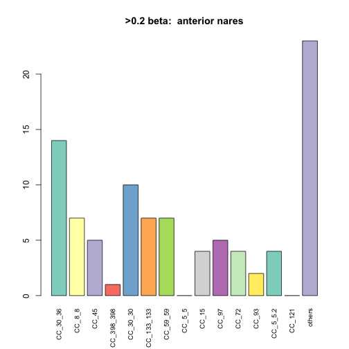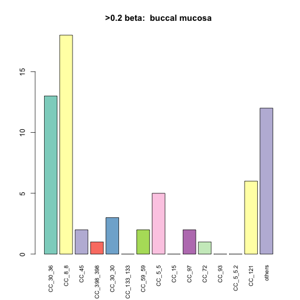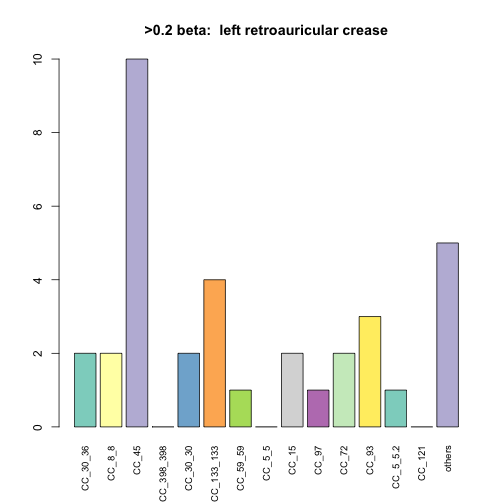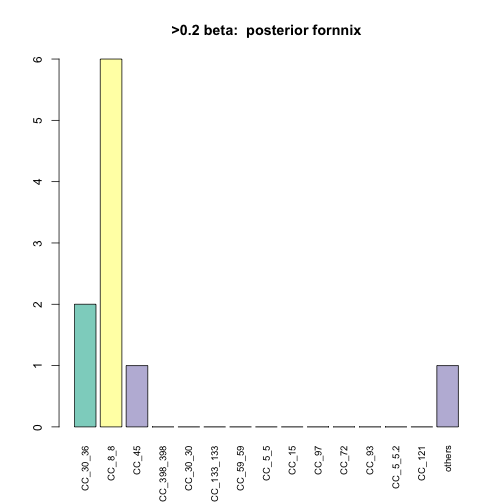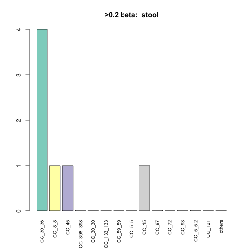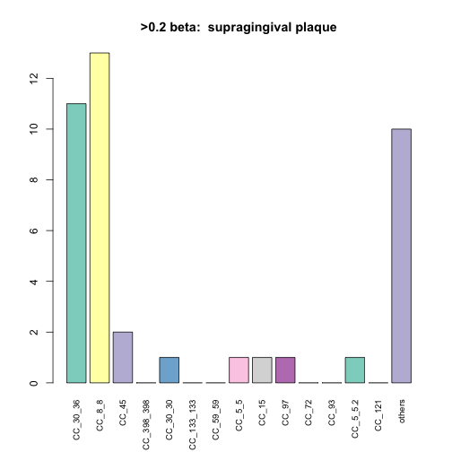

```r
for (i in bs) {
  bss_rows <- which(dat4$Body.site == i)
  if(length(bss_rows) > 0) {
    bs_df <- slice(top_score_mat,bss_rows)
    genotypes_plot(bs_df,paste(">0.5 beta: ", i),topCCs)
  }
}
```

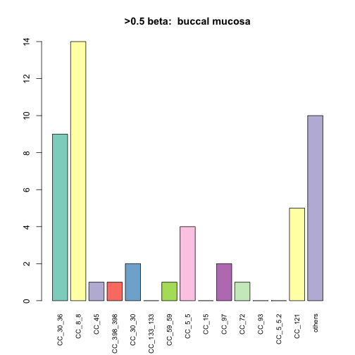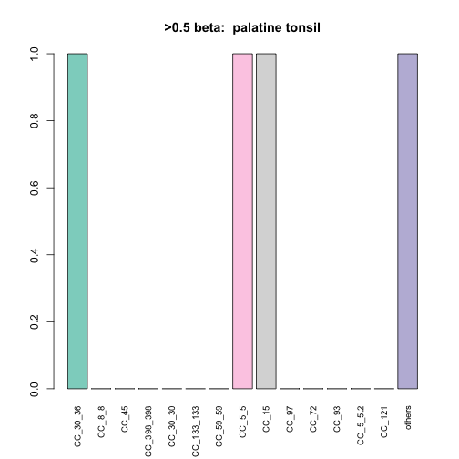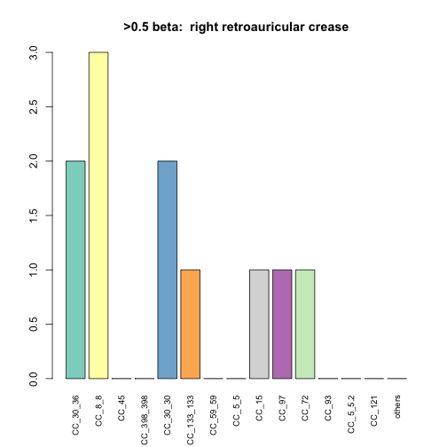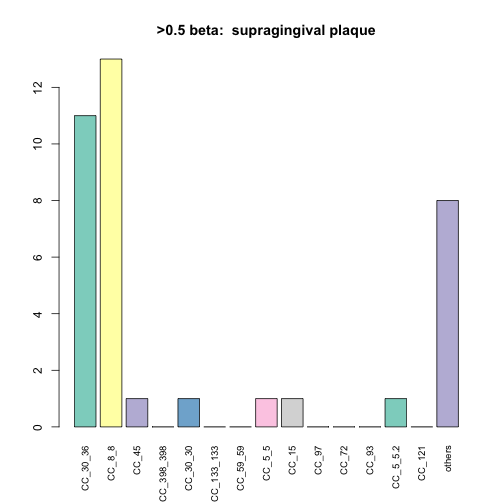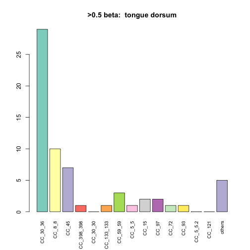
###PCA

```r
par(mfrow=c(2,2))
pcobj <- prcomp(dat6)
tr_gray <- rgb(0.5,.5,.5,.15)

for (i in bs) {
  prcols <- rep(tr_gray,nrow(dat6))
  prcols[which(dat4$Body.site == i)] <- "red"
  plot(pcobj$x,col = prcols, pch = 16, main = i)
}
```


```r
for (i in multiSubjects$Subject.Id) {
  sub_rows = which(dat4$Subject.Id == as.character(i))
  if (length(sub_rows) > 3){
    prcols <- rep(tr_gray,nrow(dat6))
    prcols[sub_rows] <- "blue"
    plot(pcobj$x,col = prcols, pch = 16, main = c("Subject",i))
  }
}
```

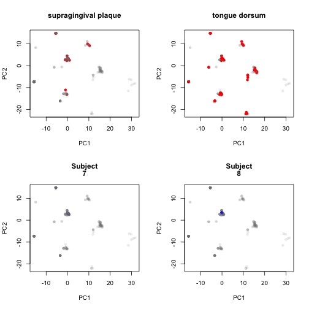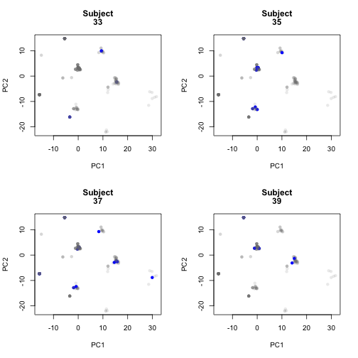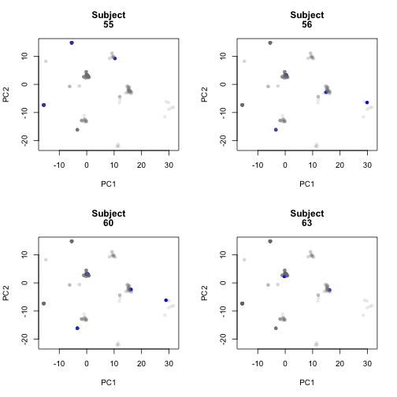
###Session Info

```r
sessionInfo()
```

```
## R version 3.2.3 (2015-12-10)
## Platform: x86_64-apple-darwin13.4.0 (64-bit)
## Running under: OS X 10.11.3 (El Capitan)
## 
## locale:
## [1] en_US.UTF-8/en_US.UTF-8/en_US.UTF-8/C/en_US.UTF-8/en_US.UTF-8
## 
## attached base packages:
## [1] stats     graphics  grDevices utils     datasets  base     
## 
## other attached packages:
##  [1] assertthat_0.1     vegan_2.3-4        lattice_0.20-33   
##  [4] permute_0.9-0      gdata_2.17.0       RColorBrewer_1.1-2
##  [7] e1071_1.6-7        dplyr_0.4.3        reshape2_1.4.1    
## [10] knitr_1.12.3      
## 
## loaded via a namespace (and not attached):
##  [1] Rcpp_0.12.3     cluster_2.0.3   magrittr_1.5    MASS_7.3-45    
##  [5] R6_2.1.2        stringr_1.0.0   plyr_1.8.3      tools_3.2.3    
##  [9] parallel_3.2.3  grid_3.2.3      nlme_3.1-125    mgcv_1.8-11    
## [13] DBI_0.3.1       class_7.3-14    gtools_3.5.0    lazyeval_0.1.10
## [17] Matrix_1.2-3    formatR_1.2.1   evaluate_0.8    stringi_1.0-1  
## [21] methods_3.2.3
```

