Starting form the filtered table from 'HMP_coverage40.Rmd'.  Run a series of analysis to look at relationships between body site and subjects.


```r
print(date())
```

```
## [1] "Wed Mar  2 17:04:23 2016"
```

```r
library(reshape2)
#library(igraph)
library(dplyr)
```

```
## 
## Attaching package: 'dplyr'
```

```
## The following objects are masked from 'package:stats':
## 
##     filter, lag
```

```
## The following objects are masked from 'package:base':
## 
##     intersect, setdiff, setequal, union
```

```r
#library(biomod2)
library(e1071)
library(RColorBrewer)
library(gdata)
```

```
## gdata: read.xls support for 'XLS' (Excel 97-2004) files ENABLED.
```

```
## 
```

```
## gdata: read.xls support for 'XLSX' (Excel 2007+) files ENABLED.
```

```
## 
## Attaching package: 'gdata'
```

```
## The following objects are masked from 'package:dplyr':
## 
##     combine, first, last
```

```
## The following object is masked from 'package:stats':
## 
##     nobs
```

```
## The following object is masked from 'package:utils':
## 
##     object.size
```

```r
library(vegan)
```

```
## Loading required package: permute
```

```
## Loading required package: lattice
```

```
## This is vegan 2.3-4
```

```r
library(assertthat)
source('./staph_metagenome_tools.R', echo=TRUE)
```

```
## 
## > bintr <- function(mat, cutoff) {
## +     mat[which(mat > cutoff)] <- 1
## +     mat[which(!(mat > cutoff))] <- 0
## +     return(mat)
## + }
## 
## > calc_FTS <- function(pop, mini) {
## +     fishmat <- matrix(c(mini[1], mini[2], pop[1] - mini[1], pop[2] - 
## +         mini[2]), ncol = 2, nrow = 2)
## +  .... [TRUNCATED] 
## 
## > calc_hits <- function(nameset, mat) {
## +     minimat <- select(mat, one_of(nameset))[rownames(mat) %in% 
## +         nameset, ]
## +     minimat.size <- ( .... [TRUNCATED] 
## 
## > calc_hits_slice <- function(nameset, mat) {
## +     minimat <- slice(mat, nameset)[, nameset]
## +     minimat.hits <- sum(minimat)/2
## +     return(minima .... [TRUNCATED] 
## 
## > create_cooccur_mat <- function(mat) {
## +     library(reshape2)
## +     dat2 <- melt(mat)
## +     w <- dcast(dat2, V2 ~ V1)
## +     x <- as.matrix(w[, -1])
##  .... [TRUNCATED] 
## 
## > genotypes_plot <- function(mat, tit, top_genos) {
## +     if (length(top_genos) == 0) {
## +         top_genos <- c("CC_30", "CC_8", "CC_45", "CC_398", " ..." ... [TRUNCATED] 
## 
## > all_genotypes_plot <- function(mat, tit) {
## +     cS <- colSums(mat)
## +     barplot(cS, main = tit, las = 3, cex.names = 0.8, col = "gray")
## + }
## 
## > run_bs_subj_adonis <- function(df, bs_vec, subj_vec) {
## +     library(e1071)
## +     library(vegan)
## +     body_site_adonis <- adonis(df ~ bs_vec)
## +     .... [TRUNCATED] 
## 
## > make_subtype_matrix <- function(df) {
## +     library(dplyr)
## +     mat <- select(df, matches("CC")) %>% as.matrix
## +     return(mat)
## + }
## 
## > plot_coverages <- function(combined.df, titl) {
## +     check_staph_df(combined.df)
## +     par(mar = c(12, 4, 4, 2), cex = 0.8)
## +     with(combined.df, .... [TRUNCATED] 
## 
## > plot_adjusted_coverages <- function(combined.df, titl) {
## +     check_staph_df(combined.df)
## +     stcols <- grep("CC|MLST", colnames(combined.df))
## +  .... [TRUNCATED] 
## 
## > plot_mecA <- function(combined.df, titl) {
## +     check_staph_df(combined.df)
## +     with(combined.df, plot(Staph_cov, mecA_cov, col = Body.site, 
## +   .... [TRUNCATED] 
## 
## > plot_diversity_vers_cov <- function(combined.df, titl) {
## +     library(vegan)
## +     check_staph_df(combined.df)
## +     stcols <- grep("CC|MLST", coln .... [TRUNCATED] 
## 
## > check_staph_df <- function(df) {
## +     library(assertthat)
## +     assert_that(length(grep("Body.site", colnames(df))) == 1)
## +     assert_that(length( .... [TRUNCATED] 
## 
## > subject_perm <- function(df, multiSubjects, hamming_mat) {
## +     library(gdata)
## +     check_staph_df(df)
## +     sub1.hits = 0
## +     sub1.cells = 0
## +  .... [TRUNCATED] 
## 
## > by_factor_perm <- function(bs, df, hamming_mat) {
## +     check_staph_df(df)
## +     for (i in bs) {
## +         bss_rows <- which(df$Body.site == i)
## +    .... [TRUNCATED] 
## 
## > intra_body_FTS <- function(body1, body2, df, multiSubjects, 
## +     u) {
## +     library(dplyr)
## +     check_staph_df(df)
## +     temp.an <- filter(df, Bo .... [TRUNCATED] 
## 
## > merge_CCs <- function(in_data, CC) {
## +     new_col <- select(in_data, matches(CC)) %>% rowSums()
## +     in_data <- select(in_data, -(matches(CC)))
## +  .... [TRUNCATED] 
## 
## > plot_CC_types <- function(CC, CCcol = "red", mat, 
## +     SRA_file, map11, map10, plotdir, cutoff = 0.2) {
## +     library(RgoogleMaps)
## +     crows <-  .... [TRUNCATED] 
## 
## > avg_geog_dist <- function(p) {
## +     mat <- as.data.frame(combinations(nrow(p), 2))
## +     dist_vec <- sapply(1:nrow(mat), function(x) distance.chord .... [TRUNCATED] 
## 
## > rand_distances <- function(n, latlon, perms = 1000) {
## +     res_vec <- replicate(perms, avg_geog_dist(sample_n(latlon, 
## +         n)), simplify = "v ..." ... [TRUNCATED] 
## 
## > distance.chord <- function(point1, point2) {
## +     R <- 6371
## +     p1rad <- point1 * pi/180
## +     p2rad <- point2 * pi/180
## +     lat <- p1rad[2]
## +   .... [TRUNCATED] 
## 
## > CC_geog_perm_test <- function(SRA_file, CC, cutoff, 
## +     s = 234523, reps = 1000) {
## +     crows <- which(SRA_file[[CC]] > cutoff)
## +     CC_df <- s .... [TRUNCATED] 
## 
## > decorate_staph_tree <- function(CC, tree, strains, 
## +     cutoff = 0.65, deco = "red") {
## +     tag_list <- filter(strains, grepl(CC, Reference.CC))  .... [TRUNCATED] 
## 
## > dist_between_stations <- function(pairs, geog.mat) {
## +     p1 <- filter(geog.mat, Run == pairs[1]) %>% select(Logitude, 
## +         Latitude) %>% t() .... [TRUNCATED] 
## 
## > H_distance_between_stations <- function(pairs, mat) {
## +     h1 <- filter(mat, Run == pairs[1])[, 2:ncol(mat)] %>% t() %>% 
## +         as.vector()
## +   .... [TRUNCATED]
```

###Read in data file created in earlier pipeline


```r
dat4 <- read.table("./Data/cov40_0.5")
```

###Create data files

```r
#list of all subjects with more than one sample
multiSubjects <- count(dat4,Subject.Id) %>% filter(n > 1) %>% select(Subject.Id ) 
dat5 <- make_subtype_matrix(dat4)
print(dim(dat5))
```

```
## [1] 149  40
```

```r
#create Hamming dist matrices with and without cutof  min value of 0.2
dat4$Subject.Id <- as.factor(dat4$Subject.Id)
dat6 <- make_subtype_matrix(dat4) %>% bintr(0.2) %>% hamming.distance %>% data.frame 
dat8 <- make_subtype_matrix(dat4) %>% hamming.distance %>% data.frame 
```
#Subtype abundance

```r
colSums(dat5 > 0.2) %>% sort
```

```
##   CC_5_5.4   CC_8_254      CC_49      CC_50      CC_78     CC_123 
##          0          0          0          0          0          0 
##     CC_130    CC_1021     CC_1_1   CC_5_5.3      CC_22 CC_75_1850 
##          0          0          1          1          1          1 
## CC_239_239     CC_425     CC_522    CC_2198    CC_2361   CC_8_8.2 
##          1          1          1          1          1          2 
##   CC_8_8.3      CC_80     CC_121     CC_291       CC_9      CC_20 
##          2          2          2          2          3          3 
## CC_151_151     CC_700     CC_779   CC_5_5.2     CC_5_5      CC_97 
##          3          3          3          5          6          6 
##      CC_93      CC_15      CC_72   CC_59_59   CC_30_30 CC_133_133 
##          7          8          8         10         12         14 
##      CC_45     CC_8_8 CC_398_398   CC_30_36 
##         19         23         23         57
```


### PERMANOVA

test for significant associations of subtype with with bodysite and subject.  us e Hamming dist. matrix. Two levels, one with a beta cutoff for all samples > 0.2 and one without

```r
set.seed(344098)
run_bs_subj_adonis(dat6,dat4$Body.site,dat4$Subject.Id)
```

```
## 
## Call:
## adonis(formula = df ~ bs_vec) 
## 
## Permutation: free
## Number of permutations: 999
## 
## Terms added sequentially (first to last)
## 
##            Df SumsOfSqs MeanSqs F.Model      R2 Pr(>F)    
## bs_vec      8     87.02 10.8777  2.9408 0.14387  0.001 ***
## Residuals 140    517.85  3.6989         0.85613           
## Total     148    604.87                 1.00000           
## ---
## Signif. codes:  0 '***' 0.001 '**' 0.01 '*' 0.05 '.' 0.1 ' ' 1
## 
## 	Homogeneity of multivariate dispersions
## 
## Call: betadisper(d = dist(df), group = bs_vec)
## 
## No. of Positive Eigenvalues: 31
## No. of Negative Eigenvalues: 0
## 
## Average distance to median:
##               anterior nares attached keratinized gingiva 
##                       10.627                        5.033 
##                buccal mucosa                  hard palate 
##                        8.068                        0.000 
##   left retroauricular crease  right retroauricular crease 
##                        9.506                       10.734 
##                        stool         supragingival plaque 
##                        0.000                        7.616 
##                tongue dorsum 
##                       11.328 
## 
## Eigenvalues for PCoA axes:
##     PCoA1     PCoA2     PCoA3     PCoA4     PCoA5     PCoA6     PCoA7 
## 9694.2621 5103.0362 1481.0537 1320.6217  828.2576  723.7956  352.2669 
##     PCoA8 
##  337.7491 
##            Df    Sum Sq  Mean Sq        F N.Perm Pr(>F)
## Groups      8  445.5892 55.69865 4.824881    999  0.001
## Residuals 140 1616.1664 11.54405       NA     NA     NA
## 
## Call:
## adonis(formula = df ~ subj_vec) 
## 
## Permutation: free
## Number of permutations: 999
## 
## Terms added sequentially (first to last)
## 
##            Df SumsOfSqs MeanSqs F.Model      R2 Pr(>F)  
## subj_vec   81    363.72  4.4904  1.2476 0.60132  0.024 *
## Residuals  67    241.15  3.5992         0.39868         
## Total     148    604.87                 1.00000         
## ---
## Signif. codes:  0 '***' 0.001 '**' 0.01 '*' 0.05 '.' 0.1 ' ' 1
## 
## 	Homogeneity of multivariate dispersions
## 
## Call: betadisper(d = dist(df), group = subj_vec)
## 
## No. of Positive Eigenvalues: 31
## No. of Negative Eigenvalues: 0
## 
## Average distance to median:
##         1         2         5         6         8         9        10 
## 0.000e+00 0.000e+00 0.000e+00 0.000e+00 6.364e-14 0.000e+00 0.000e+00 
##        11        12        13        15        18        19        20 
## 0.000e+00 1.018e+01 7.539e+00 1.195e+01 8.474e+00 0.000e+00 0.000e+00 
##        21        22        24        25        26        27        28 
## 0.000e+00 0.000e+00 0.000e+00 0.000e+00 6.298e+00 0.000e+00 8.101e+00 
##        29        30        31        32        33        34        35 
## 9.233e+00 6.576e+00 0.000e+00 1.136e+01 1.055e+01 8.718e+00 6.767e+00 
##        37        38        39        40        41        42        43 
## 1.096e+01 3.873e+00 8.199e+00 1.005e+01 6.791e+00 0.000e+00 6.103e+00 
##        44        45        46        47        49        51        52 
## 4.899e+00 0.000e+00 0.000e+00 0.000e+00 0.000e+00 0.000e+00 0.000e+00 
##        54        58        60        62        63        64        65 
## 0.000e+00 0.000e+00 9.871e+00 0.000e+00 1.246e+01 0.000e+00 0.000e+00 
##        66        67        68        69        70        72        73 
## 0.000e+00 0.000e+00 0.000e+00 1.145e+01 0.000e+00 1.006e+01 1.319e+01 
##        74        75        76        79        80        81        82 
## 0.000e+00 0.000e+00 5.591e+00 3.154e-14 0.000e+00 3.000e+00 0.000e+00 
##        83        84        85        86        88        89        90 
## 7.009e-14 7.856e-14 0.000e+00 0.000e+00 0.000e+00 0.000e+00 0.000e+00 
##        93        94        95        96        97        98       100 
## 0.000e+00 0.000e+00 0.000e+00 0.000e+00 0.000e+00 0.000e+00 0.000e+00 
##       102       103       104       107       110 
## 0.000e+00 0.000e+00 0.000e+00 0.000e+00 0.000e+00 
## 
## Eigenvalues for PCoA axes:
##     PCoA1     PCoA2     PCoA3     PCoA4     PCoA5     PCoA6     PCoA7 
## 9694.2621 5103.0362 1481.0537 1320.6217  828.2576  723.7956  352.2669 
##     PCoA8 
##  337.7491 
##           Df   Sum Sq  Mean Sq        F N.Perm Pr(>F)
## Groups    81 3231.713 39.89770 1.227196    999  0.311
## Residuals 67 2178.255 32.51127       NA     NA     NA
## 
## Call:
## adonis(formula = df ~ bs_vec + subj_vec) 
## 
## Permutation: free
## Number of permutations: 999
## 
## Terms added sequentially (first to last)
## 
##            Df SumsOfSqs MeanSqs F.Model      R2 Pr(>F)    
## bs_vec      8     87.02 10.8777  3.4643 0.14387  0.001 ***
## subj_vec   80    329.45  4.1182  1.3115 0.54467  0.010 ** 
## Residuals  60    188.40  3.1399         0.31146           
## Total     148    604.87                 1.00000           
## ---
## Signif. codes:  0 '***' 0.001 '**' 0.01 '*' 0.05 '.' 0.1 ' ' 1
```

```r
run_bs_subj_adonis(dat8,dat4$Body.site,dat4$Subject.Id)
```

```
## 
## Call:
## adonis(formula = df ~ bs_vec) 
## 
## Permutation: free
## Number of permutations: 999
## 
## Terms added sequentially (first to last)
## 
##            Df SumsOfSqs MeanSqs F.Model      R2 Pr(>F)  
## bs_vec      8    1216.4 152.056  2.7131 0.13422  0.018 *
## Residuals 140    7846.4  56.046         0.86578         
## Total     148    9062.9                 1.00000         
## ---
## Signif. codes:  0 '***' 0.001 '**' 0.01 '*' 0.05 '.' 0.1 ' ' 1
## 
## 	Homogeneity of multivariate dispersions
## 
## Call: betadisper(d = dist(df), group = bs_vec)
## 
## No. of Positive Eigenvalues: 145
## No. of Negative Eigenvalues: 0
## 
## Average distance to median:
##               anterior nares attached keratinized gingiva 
##                       62.031                        6.009 
##                buccal mucosa                  hard palate 
##                       10.949                        0.000 
##   left retroauricular crease  right retroauricular crease 
##                       26.197                       21.104 
##                        stool         supragingival plaque 
##                        0.000                        4.822 
##                tongue dorsum 
##                       18.310 
## 
## Eigenvalues for PCoA axes:
##       PCoA1       PCoA2       PCoA3       PCoA4       PCoA5       PCoA6 
## 300035.7929  13569.3306   2626.5527   2091.0955   1775.9370   1512.6625 
##       PCoA7       PCoA8 
##   1278.3080    992.7362 
##            Df   Sum Sq   Mean Sq        F N.Perm Pr(>F)
## Groups      8 38728.19 4841.0236 7.788662    999  0.008
## Residuals 140 87016.65  621.5475       NA     NA     NA
## 
## Call:
## adonis(formula = df ~ subj_vec) 
## 
## Permutation: free
## Number of permutations: 999
## 
## Terms added sequentially (first to last)
## 
##            Df SumsOfSqs MeanSqs F.Model      R2 Pr(>F)
## subj_vec   81    4949.1  61.100 0.99513 0.54609  0.516
## Residuals  67    4113.8  61.399         0.45391       
## Total     148    9062.9                 1.00000       
## 
## 	Homogeneity of multivariate dispersions
## 
## Call: betadisper(d = dist(df), group = subj_vec)
## 
## No. of Positive Eigenvalues: 145
## No. of Negative Eigenvalues: 0
## 
## Average distance to median:
##         1         2         5         6         8         9        10 
## 0.000e+00 0.000e+00 0.000e+00 0.000e+00 4.300e+01 0.000e+00 0.000e+00 
##        11        12        13        15        18        19        20 
## 0.000e+00 2.878e+01 5.462e+01 2.126e+01 3.002e+01 0.000e+00 0.000e+00 
##        21        22        24        25        26        27        28 
## 0.000e+00 0.000e+00 0.000e+00 0.000e+00 1.218e+01 0.000e+00 2.201e+01 
##        29        30        31        32        33        34        35 
## 7.228e+00 1.792e+01 0.000e+00 2.137e+01 1.081e+01 6.408e+01 2.450e+01 
##        37        38        39        40        41        42        43 
## 4.683e+01 1.972e+01 2.108e+01 1.824e+01 1.469e+01 0.000e+00 1.226e+02 
##        44        45        46        47        49        51        52 
## 5.943e+01 0.000e+00 0.000e+00 0.000e+00 0.000e+00 0.000e+00 0.000e+00 
##        54        58        60        62        63        64        65 
## 0.000e+00 0.000e+00 1.173e+01 0.000e+00 2.630e+01 0.000e+00 0.000e+00 
##        66        67        68        69        70        72        73 
## 0.000e+00 0.000e+00 0.000e+00 8.201e+00 0.000e+00 1.497e+01 8.382e+00 
##        74        75        76        79        80        81        82 
## 0.000e+00 0.000e+00 1.055e+01 7.714e+00 0.000e+00 7.382e+00 0.000e+00 
##        83        84        85        86        88        89        90 
## 9.824e-13 1.899e+01 0.000e+00 0.000e+00 0.000e+00 0.000e+00 0.000e+00 
##        93        94        95        96        97        98       100 
## 0.000e+00 0.000e+00 0.000e+00 0.000e+00 0.000e+00 0.000e+00 0.000e+00 
##       102       103       104       107       110 
## 0.000e+00 0.000e+00 0.000e+00 0.000e+00 0.000e+00 
## 
## Eigenvalues for PCoA axes:
##       PCoA1       PCoA2       PCoA3       PCoA4       PCoA5       PCoA6 
## 300035.7929  13569.3306   2626.5527   2091.0955   1775.9370   1512.6625 
##       PCoA7       PCoA8 
##   1278.3080    992.7362 
##           Df   Sum Sq  Mean Sq        F N.Perm Pr(>F)
## Groups    81 63079.06 778.7538 1.390941    999  0.293
## Residuals 67 37511.65 559.8754       NA     NA     NA
## 
## Call:
## adonis(formula = df ~ bs_vec + subj_vec) 
## 
## Permutation: free
## Number of permutations: 999
## 
## Terms added sequentially (first to last)
## 
##            Df SumsOfSqs MeanSqs F.Model      R2 Pr(>F)  
## bs_vec      8    1216.4 152.056  2.8201 0.13422  0.014 *
## subj_vec   80    4611.3  57.642  1.0691 0.50882  0.383  
## Residuals  60    3235.1  53.918         0.35696         
## Total     148    9062.9                 1.00000         
## ---
## Signif. codes:  0 '***' 0.001 '**' 0.01 '*' 0.05 '.' 0.1 ' ' 1
```
### Permutation tests

```r
#test ffor whether intra-subject distance greater than intersubject
subject_perm(dat4,multiSubjects,dat6)
```

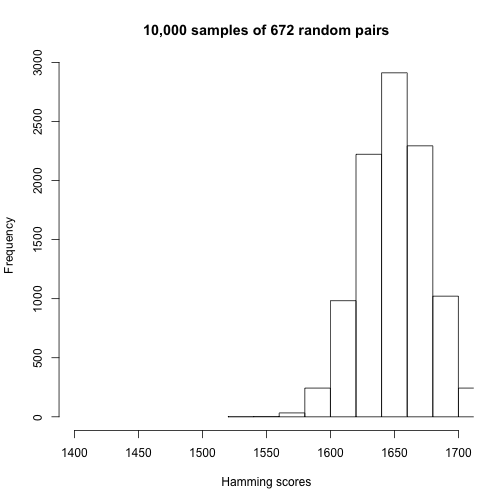

```
## Score for intraperson hits =  363 
## [1] "Quartlies for random distribution"
##   0%  25%  50%  75% 100% 
##  350  390  399  408  443 
## Empirical p value =  0.0044
```

```r
#now look at the same test between body sites
bs <- levels(dat4$Body.site)
by_factor_perm(bs,dat4,dat6)
```

```
## [1] "anterior nares"
## [1] "Number of samples " "22"                
## [1] "Distribution of random hits"
##   0%  25%  50%  75% 100% 
##  412  575  611  644  791 
## [1] 543
## Empirical p value [1] 0.0995
## 
## Zero samples in  attached keratinized gingiva[1] "buccal mucosa"
## [1] "Number of samples " "9"                 
## [1] "Distribution of random hits"
##   0%  25%  50%  75% 100% 
##   40   86   96  104  148 
## [1] 66
## Empirical p value [1] 0.0239
## 
## Zero samples in  hard palate[1] "left retroauricular crease"
## [1] "Number of samples " "15"                
## [1] "Distribution of random hits"
##   0%  25%  50%  75% 100% 
##  166  258  278  296  376 
## [1] 268
## Empirical p value [1] 0.378
## 
## [1] "right retroauricular crease"
## [1] "Number of samples " "23"                
## [1] "Distribution of random hits"
##   0%  25%  50%  75% 100% 
##  434  632  670  704  870 
## [1] 720
## Empirical p value [1] 0.8332
## 
## Zero samples in  stoolZero samples in  supragingival plaque[1] "tongue dorsum"
## [1] "Number of samples " "73"                
## [1] "Distribution of random hits"
##   0%  25%  50%  75% 100% 
## 6066 6774 6938 7102 7856 
## [1] 6574
## Empirical p value [1] 0.0672
```
###Plots of subtype distribution

```r
presence_mat <- as.data.frame(bintr(dat5,0.2))
top_score_mat <- as.data.frame(bintr(dat5,0.5))
topCCs <- names(sort(colSums(presence_mat), decreasing = TRUE)[1:14])
# png("~/Dropbox/ARTICLES_BY_TDR/2015-staph-metagenome/HMP_barchart.png",width=640, height =640, res = 75)
# dev.off()
genotypes_plot(presence_mat,"Top CCs, 0.025X cutff, subtypes present > 0.2",topCCs)
```

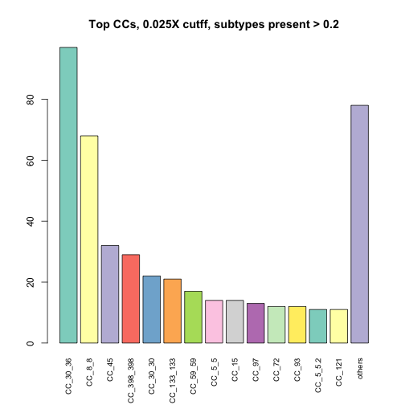

```r
genotypes_plot(top_score_mat,"Top CCs, 0.025X cutoff, subtypes present > 0.5",topCCs)
```


```r
all_genotypes_plot(presence_mat,"All CCs, 0.025X cutoff, subtypes present > 0.2")
```

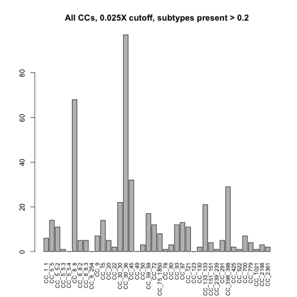

```r
all_genotypes_plot(top_score_mat,"All CCs, 0.025X cutoff, subtypes present > 0.5")
```

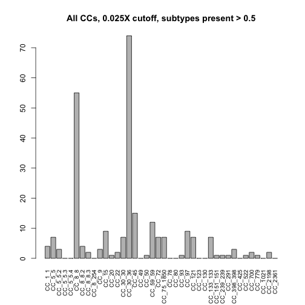

```r
for (i in bs) {
  bss_rows <- which(dat4$Body.site == i)
  if(length(bss_rows) > 0) {
    bs_df <- slice(presence_mat,bss_rows)
    genotypes_plot(bs_df,paste(">0.2 beta: ", i),topCCs)
  }
}
```

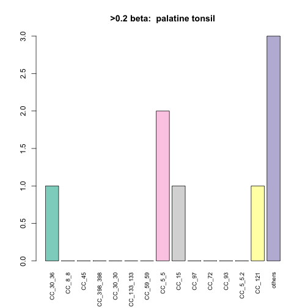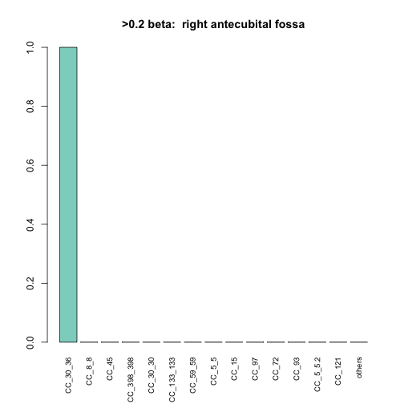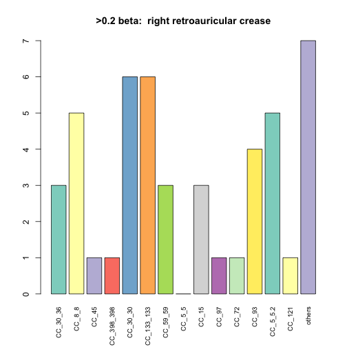

```r
for (i in bs) {
  bss_rows <- which(dat4$Body.site == i)
  if(length(bss_rows) > 0) {
    bs_df <- slice(top_score_mat,bss_rows)
    genotypes_plot(bs_df,paste(">0.5 beta: ", i),topCCs)
  }
}
```

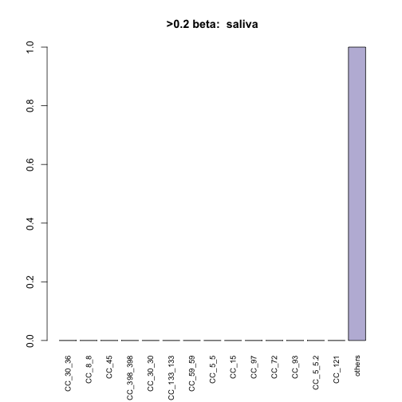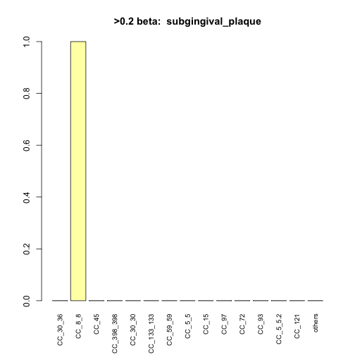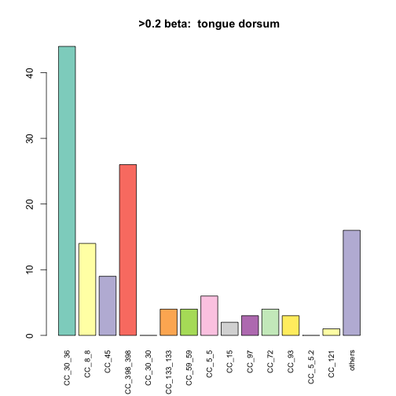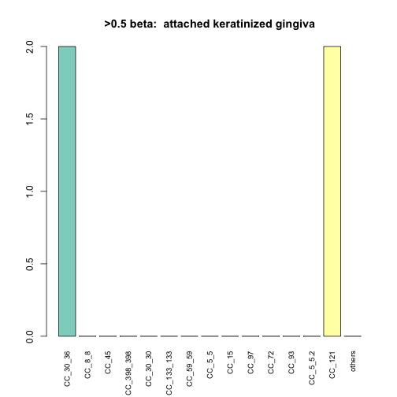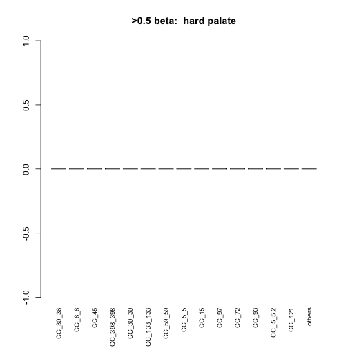
###PCA

```r
par(mfrow=c(2,2))
pcobj <- prcomp(dat6)
tr_gray <- rgb(0.5,.5,.5,.15)

for (i in bs) {
  prcols <- rep(tr_gray,nrow(dat6))
  prcols[which(dat4$Body.site == i)] <- "red"
  plot(pcobj$x,col = prcols, pch = 16, main = i)
}
```


```r
for (i in multiSubjects$Subject.Id) {
  sub_rows = which(dat4$Subject.Id == as.character(i))
  if (length(sub_rows) > 3){
    prcols <- rep(tr_gray,nrow(dat6))
    prcols[sub_rows] <- "blue"
    plot(pcobj$x,col = prcols, pch = 16, main = c("Subject",i))
  }
}
```


###Session Info

```r
sessionInfo()
```

```
## R version 3.2.3 (2015-12-10)
## Platform: x86_64-apple-darwin13.4.0 (64-bit)
## Running under: OS X 10.11.3 (El Capitan)
## 
## locale:
## [1] en_US.UTF-8/en_US.UTF-8/en_US.UTF-8/C/en_US.UTF-8/en_US.UTF-8
## 
## attached base packages:
## [1] stats     graphics  grDevices utils     datasets  base     
## 
## other attached packages:
##  [1] assertthat_0.1     vegan_2.3-4        lattice_0.20-33   
##  [4] permute_0.9-0      gdata_2.17.0       RColorBrewer_1.1-2
##  [7] e1071_1.6-7        dplyr_0.4.3        reshape2_1.4.1    
## [10] knitr_1.12.3      
## 
## loaded via a namespace (and not attached):
##  [1] Rcpp_0.12.3     cluster_2.0.3   magrittr_1.5    MASS_7.3-45    
##  [5] R6_2.1.2        stringr_1.0.0   plyr_1.8.3      tools_3.2.3    
##  [9] parallel_3.2.3  grid_3.2.3      nlme_3.1-125    mgcv_1.8-11    
## [13] DBI_0.3.1       class_7.3-14    gtools_3.5.0    lazyeval_0.1.10
## [17] Matrix_1.2-3    formatR_1.2.1   evaluate_0.8    stringi_1.0-1  
## [21] methods_3.2.3
```

