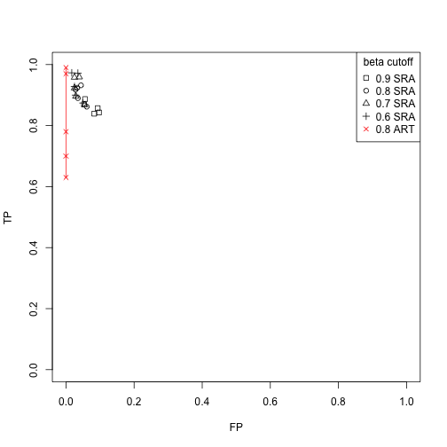

```r
betas <- c("0.9","0.8","0.7","0.6")
covs <- c("0.025X","0.05X","0.1X","0.5X", "0.75X")
sens_mat <- matrix(nrow = 5, ncol = 4, c(0.839,0.87,0.887,0.857,0.843,0.862,0.89,0.918,0.932,0.924,0.868,0.896,0.923,0.959,0.958,0.874,0.9,0.928,0.972,0.973))
spec_mat <- matrix(nrow = 5, ncol = 4,c(0.917,0.947,0.944,0.907,0.903,0.939,0.965,0.972,0.956,0.967,0.945,0.971,0.975,0.961,0.975,0.95,0.972,0.975,0.965,0.983))
artificial_data <- c(0.63,0.70,0.78,0.97,0.99)
```
PLots


```r
plot(1-spec_mat[,1],sens_mat[,1], xlim = c(0,1),ylim=c(0,1),ylab = "TP", xlab = "FP", pch = 0)
points(1-spec_mat[,2],sens_mat[,2], pch = 1)
points(1-spec_mat[,3],sens_mat[,3], pch = 2)
points(1-spec_mat[,4],sens_mat[,4], pch = 3)
lines(c(0,0,0,0,0), artificial_data, type = "o", pch = 4, col = "red")
legend("topright", pch = 0:4, legend = c("0.9 SRA","0.8 SRA","0.7 SRA","0.6 SRA", "0.8 ART"), col = c("black","black","black","black","red"),title = "beta cutoff")
```

 


```
## R version 3.2.1 (2015-06-18)
## Platform: x86_64-apple-darwin13.4.0 (64-bit)
## Running under: OS X 10.10.5 (Yosemite)
## 
## locale:
## [1] en_US.UTF-8/en_US.UTF-8/en_US.UTF-8/C/en_US.UTF-8/en_US.UTF-8
## 
## attached base packages:
## [1] stats     graphics  grDevices utils     datasets  base     
## 
## other attached packages:
## [1] knitr_1.11
## 
## loaded via a namespace (and not attached):
## [1] magrittr_1.5   formatR_1.2    tools_3.2.1    stringi_0.5-5 
## [5] methods_3.2.1  stringr_1.0.0  evaluate_0.7.2
```


