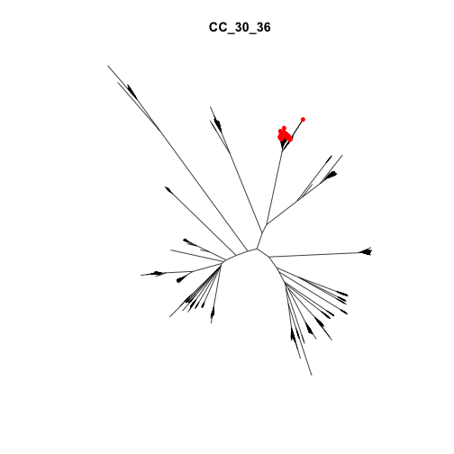
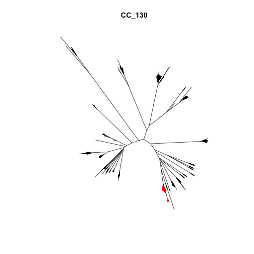
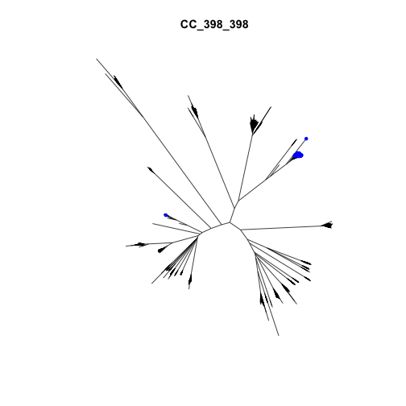
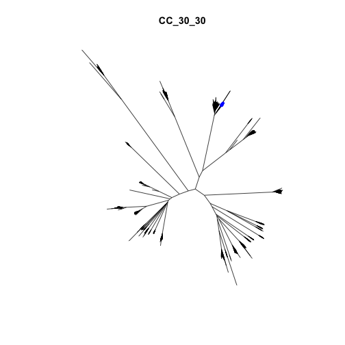

```r
library(phangorn)
```

```
## Loading required package: ape
```

```r
library(dplyr)
```

```
## 
## Attaching package: 'dplyr'
```

```
## The following objects are masked from 'package:stats':
## 
##     filter, lag
```

```
## The following objects are masked from 'package:base':
## 
##     intersect, setdiff, setequal, union
```

```r
source('./staph_metagenome_tools.R')
```


```r
strains <- read.csv("./Data/2114_strain_subtypes.csv", header = TRUE, stringsAsFactors = FALSE)
CCs <- select(strains, Reference.CC) %>% unique() %>% arrange()
```

Load tree


```r
load("~/dm")
NJ <- nj(dm)
plot(NJ, "unrooted", show.tip.label = FALSE)
```


 Find and label CC_30 lables
 
 Run major groups with beta cutoff of .65

```r
decorate_staph_tree("CC_30",NJ,strains)
```


```r
decorate_staph_tree("CC_5_5",NJ,strains)
```


```r
decorate_staph_tree("CC_8_",NJ,strains)
```


```r
for (i in CCs$Reference.CC){
  decorate_staph_tree(i,NJ,strains)
}
```


Run major groups with beta cutoff of .80

```r
decorate_staph_tree("CC_30",NJ,strains, cutoff = 0.8, deco = "blue")
```


```r
decorate_staph_tree("CC_5_5",NJ,strains)
```


```r
decorate_staph_tree("CC_8_",NJ,strains)
```


```r
for (i in CCs$Reference.CC){
  decorate_staph_tree(i,NJ,strains,cutoff = 0.8, deco = "blue")
}
```


Decorated tree figure for grant


```r
plot(NJ, "unrooted", show.tip.label = FALSE)
#cc30
tl <- filter(strains,grepl("CC_30",Reference.CC)) %>% filter(Beta > 0.80) %>% select(Sample.Id.of.0.75X)
tps <- which(NJ$tip.label %in% tl$Sample.Id.of.0.75X)
tiplabels(tip = tps, pch= 20, col = "red")
##CC_5_5
tl <- filter(strains,grepl("CC_5_5",Reference.CC)) %>% filter(Beta > 0.80) %>% select(Sample.Id.of.0.75X)
tps <- which(NJ$tip.label %in% tl$Sample.Id.of.0.75X)
tiplabels(tip = tps, pch= 20, col = "green")
#st8
tl <- filter(strains,grepl("CC_8_8_2",Reference.CC)) %>% filter(Beta > 0.80) %>% select(Sample.Id.of.0.75X)
tps <- which(NJ$tip.label %in% tl$Sample.Id.of.0.75X)
tiplabels(tip = tps, pch= 20, col = "blue")
#st75 argentius
tl <- filter(strains,grepl("CC_75",Reference.CC)) %>% filter(Beta > 0.80) %>% select(Sample.Id.of.0.75X)
tps <- which(NJ$tip.label %in% tl$Sample.Id.of.0.75X)
tiplabels(tip = tps, pch= 20, col = "gray")
#cc133
tl <- filter(strains,grepl("CC_133",Reference.CC)) %>% filter(Beta > 0.80) %>% select(Sample.Id.of.0.75X)
tps <- which(NJ$tip.label %in% tl$Sample.Id.of.0.75X)
tiplabels(tip = tps, pch= 20, col = "orange")
add.scale.bar()
```


Check for senstivity


```r
tl <- filter(strains,Beta > 0.80) %>% select(Sample.Id.of.0.75X)
plot(NJ, "unrooted", show.tip.label = FALSE, main = "Sensitivity: beta > 0.65")
tps <- which(NJ$tip.label %in% tl$Sample.Id.of.0.75X)
tiplabels(tip = tps, pch= 20, col = "red")
```


Look at SNP#1752540, which is common in ST398

```r
SNP <- read.table("./Data/SNP1752540_sample_tags.txt", header = FALSE, stringsAsFactors = FALSE)
SNPtps <- which(NJ$tip.label %in% SNP$V1)
plot(NJ, "unrooted", show.tip.label = FALSE, main = "SNP#1752540")
tiplabels(tip = SNPtps, pch= 20, col = "red")
```


