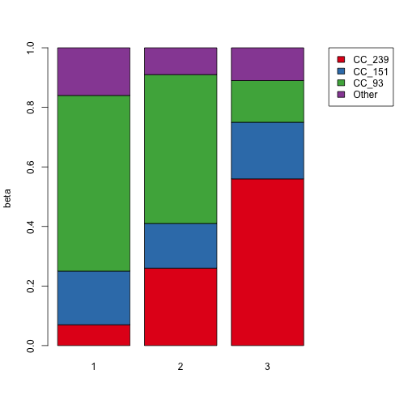

```r
library(dplyr)
```

```
## 
## Attaching package: 'dplyr'
## 
## The following objects are masked from 'package:stats':
## 
##     filter, lag
## 
## The following objects are masked from 'package:base':
## 
##     intersect, setdiff, setequal, union
```

```r
library(RColorBrewer)
pure <- read.csv("./Data/Microbiome_simulation.txt", sep="\t")
```


```
## Source: local data frame [9 x 3]
## Groups: Sample
## 
##         Sample Strain_Name Estimated_Beta
## 1 Microbiome 1  CC_239_239     0.06966881
## 2 Microbiome 1     MLST_93     0.17951088
## 3 Microbiome 1  CC_151_151     0.59253168
## 4 Microbiome 2  CC_239_239     0.26058727
## 5 Microbiome 2     MLST_93     0.14640981
## 6 Microbiome 2  CC_151_151     0.49802408
## 7 Microbiome 3  CC_239_239     0.56352481
## 8 Microbiome 3     MLST_93     0.19003762
## 9 Microbiome 3  CC_151_151     0.13970561
```

```
## Source: local data frame [3 x 2]
## 
##         Sample 1 - sum(Estimated_Beta)
## 1 Microbiome 1              0.15828863
## 2 Microbiome 2              0.09497884
## 3 Microbiome 3              0.10673196
```

```r
par(mar=c(5.1, 4.1, 4.1, 8.1), xpd=TRUE)
colnames <- brewer.pal(4,"Set1")
barplot(beta_plot,  ylab = "beta", col = colnames)
legend("topright", fill = colnames,legend = c("CC_239","CC_151","CC_93", "Other"), inset = c(-0.3,0))
```

 

