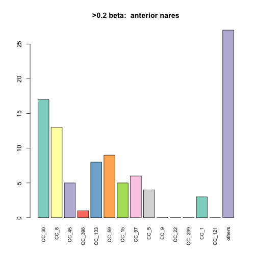
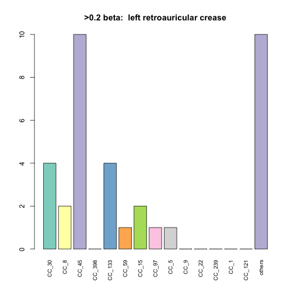
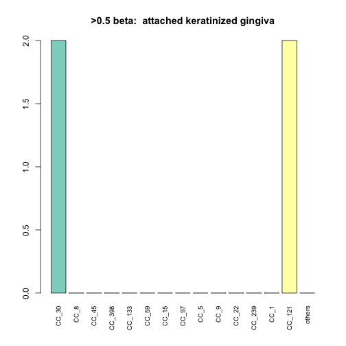
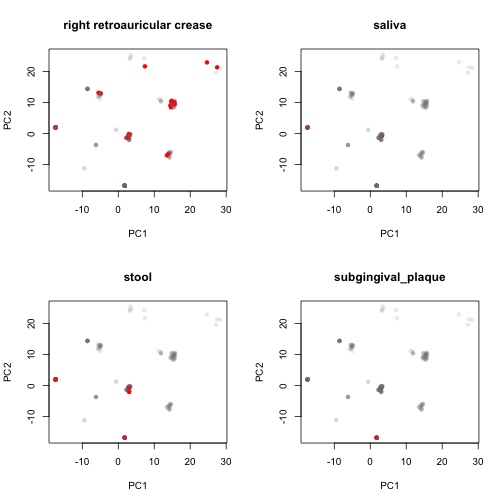
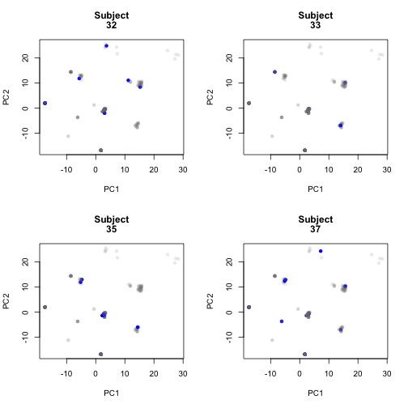

Starting form the filtered table from 'HMP_coverage.Rmd'.  Run a series of analysis to look at relationships between body site and subjects.


```r
library(reshape2)
#library(igraph)
library(dplyr)
```

```
## 
## Attaching package: 'dplyr'
## 
## The following objects are masked from 'package:stats':
## 
##     filter, lag
## 
## The following objects are masked from 'package:base':
## 
##     intersect, setdiff, setequal, union
```

```r
#library(biomod2)
library(e1071)
library(RColorBrewer)
library(gdata)
```

```
## gdata: read.xls support for 'XLS' (Excel 97-2004) files ENABLED.
## 
## gdata: read.xls support for 'XLSX' (Excel 2007+) files ENABLED.
## 
## Attaching package: 'gdata'
## 
## The following objects are masked from 'package:dplyr':
## 
##     combine, first, last
## 
## The following object is masked from 'package:stats':
## 
##     nobs
## 
## The following object is masked from 'package:utils':
## 
##     object.size
```

```r
library(vegan)
```

```
## Loading required package: permute
## Loading required package: lattice
## This is vegan 2.3-0
```

```r
library(assertthat)
source('./staph_metagenome_tools.R')
```

###Read in data file created in earlier pipeline


```r
dat4 <- read.table("./Data/combined")
```

###Create data files

```r
#list of all subjects with more than one sample
multiSubjects <- count(dat4,Subject.Id) %>% filter(n > 1) %>% select(Subject.Id ) 
dat5 <- make_subtype_matrix(dat4)
#create Hamming dist matrices with and without cutof  min value of 0.2
dat6 <- make_subtype_matrix(dat4) %>% bintr(0.2) %>% hamming.distance %>% data.frame 
dat8 <- make_subtype_matrix(dat4) %>% hamming.distance %>% data.frame 
```
#Subtype abundance

```r
colSums(dat5 > 0.2) %>% sort
```

```
##   CC_49  CC_123   CC_78  CC_239  CC_522 CC_1021   CC_22  CC_130  CC_425 
##       0       0       1       1       1       1       2       2       2 
## CC_2361   CC_50   CC_80  CC_151 CC_2198   CC_20  CC_291  CC_779    CC_1 
##       2       3       3       4       4       5       5       5       6 
##    CC_9  CC_700   CC_75  CC_121   CC_93   CC_72   CC_15   CC_97   CC_59 
##       7       7       8      11      12      13      15      15      19 
##  CC_133    CC_5  CC_398   CC_45    CC_8   CC_30 
##      22      26      29      32      85     113
```

### Permanova

test for significant associations of subtype with with bodysite and subject.  us e Hamming dist. matrix. Two levels, one with a beta cutoff for all samples > 0.2 and one without

```r
set.seed(344098)
run_bs_subj_adonis(dat6,dat4$Body.site,dat4$Subject.Id)
```

```
## 
## Call:
## adonis(formula = df ~ bs_vec) 
## 
## Permutation: free
## Number of permutations: 999
## 
## Terms added sequentially (first to last)
## 
##            Df SumsOfSqs  MeanSqs F.Model      R2 Pr(>F)    
## bs_vec     13    1.0928 0.084061  3.6727 0.12878  0.001 ***
## Residuals 323    7.3928 0.022888         0.87122           
## Total     336    8.4856                  1.00000           
## ---
## Signif. codes:  0 '***' 0.001 '**' 0.01 '*' 0.05 '.' 0.1 ' ' 1
## 
## 	Homogeneity of multivariate dispersions
## 
## Call: betadisper(d = dist(df), group = bs_vec)
## 
## No. of Positive Eigenvalues: 31
## No. of Negative Eigenvalues: 0
## 
## Average distance to median:
##               anterior nares attached keratinized gingiva 
##                       14.662                       10.954 
##                buccal mucosa                  hard palate 
##                       14.089                        0.000 
##   left retroauricular crease              palatine tonsil 
##                       15.472                       12.968 
##            posterior fornnix      right antecubital fossa 
##                        9.532                        0.000 
##  right retroauricular crease                       saliva 
##                       18.577                        0.000 
##                        stool           subgingival_plaque 
##                       10.475                        0.000 
##         supragingival plaque                tongue dorsum 
##                       13.913                       16.579 
## 
## Eigenvalues for PCoA axes:
##     PCoA1     PCoA2     PCoA3     PCoA4     PCoA5     PCoA6     PCoA7 
## 39282.726 33405.642  8375.305  3584.556  2399.674  1976.226  1496.300 
##     PCoA8 
##  1172.159 
##            Df    Sum Sq   Mean Sq        F N.Perm Pr(>F)
## Groups     13  2120.176 163.09047 4.859271    999  0.001
## Residuals 323 10840.766  33.56274       NA     NA     NA
## 
## Call:
## adonis(formula = df ~ subj_vec) 
## 
## Permutation: free
## Number of permutations: 999
## 
## Terms added sequentially (first to last)
## 
##            Df SumsOfSqs  MeanSqs F.Model     R2 Pr(>F)  
## subj_vec    1    0.0696 0.069606  2.7707 0.0082  0.043 *
## Residuals 335    8.4160 0.025122         0.9918         
## Total     336    8.4856                  1.0000         
## ---
## Signif. codes:  0 '***' 0.001 '**' 0.01 '*' 0.05 '.' 0.1 ' ' 1
## 
## 	Homogeneity of multivariate dispersions
## 
## Call: betadisper(d = dist(df), group = subj_vec)
## 
## No. of Positive Eigenvalues: 31
## No. of Negative Eigenvalues: 0
## 
## Average distance to median:
##         1         2         3         4         5         6         7 
## 9.179e+00 8.246e+00 0.000e+00 0.000e+00 0.000e+00 0.000e+00 9.592e+00 
##         8         9        10        11        12        13        14 
## 2.598e+00 1.016e+01 2.373e+01 1.187e+01 1.547e+01 1.322e+01 0.000e+00 
##        15        16        17        18        19        20        21 
## 1.731e+01 0.000e+00 0.000e+00 1.080e+01 2.182e+01 0.000e+00 9.179e+00 
##        22        23        24        25        26        27        28 
## 1.184e+01 0.000e+00 0.000e+00 1.484e+01 6.782e+00 1.180e+01 1.320e+01 
##        29        30        31        32        33        34        35 
## 1.040e+01 9.811e+00 9.179e+00 1.594e+01 1.494e+01 1.187e+01 1.275e+01 
##        36        37        38        39        40        41        42 
## 0.000e+00 1.644e+01 4.899e+00 1.527e+01 1.605e+01 1.366e+01 1.059e+01 
##        43        44        45        46        47        48        49 
## 1.139e+01 6.360e+00 0.000e+00 0.000e+00 0.000e+00 9.043e+00 0.000e+00 
##        50        51        52        53        54        55        56 
## 0.000e+00 0.000e+00 9.109e-14 0.000e+00 0.000e+00 1.450e+01 1.750e+01 
##        57        58        59        60        61        62        63 
## 1.140e+01 0.000e+00 0.000e+00 1.531e+01 0.000e+00 0.000e+00 1.266e+01 
##        64        65        66        67        68        69        70 
## 0.000e+00 1.356e+01 1.110e+01 4.372e+00 1.397e+01 1.423e+01 1.068e+01 
##        71        72        73        74        75        76        77 
## 8.117e+00 1.718e+01 1.641e+01 9.349e+00 6.119e+00 7.850e+00 1.218e+01 
##        78        79        80        81        82        83        84 
## 8.571e+00 2.702e-14 1.105e+01 1.525e+01 2.692e-14 2.935e-14 2.398e+00 
##        85        86        87        88        89        90        91 
## 0.000e+00 1.116e+01 1.356e+01 0.000e+00 0.000e+00 1.674e+01 1.149e+01 
##        92        93        94        95        96        97        98 
## 1.167e+01 1.266e+01 1.898e+01 1.578e+01 0.000e+00 1.327e+01 0.000e+00 
##        99       100       101       102       103       104       105 
## 0.000e+00 1.184e+01 0.000e+00 1.050e+01 1.130e+01 0.000e+00 0.000e+00 
##       106       107       108       109       110 
## 1.022e+01 9.434e+00 1.356e+01 0.000e+00 9.179e+00 
## 
## Eigenvalues for PCoA axes:
##     PCoA1     PCoA2     PCoA3     PCoA4     PCoA5     PCoA6     PCoA7 
## 39282.726 33405.642  8375.305  3584.556  2399.674  1976.226  1496.300 
##     PCoA8 
##  1172.159 
##            Df   Sum Sq  Mean Sq        F N.Perm Pr(>F)
## Groups    109 10398.29 95.39719 1.210388    999  0.131
## Residuals 227 17891.10 78.81540       NA     NA     NA
## 
## Call:
## adonis(formula = df ~ bs_vec + subj_vec) 
## 
## Permutation: free
## Number of permutations: 999
## 
## Terms added sequentially (first to last)
## 
##            Df SumsOfSqs  MeanSqs F.Model      R2 Pr(>F)    
## bs_vec     13    1.0928 0.084061  3.7075 0.12878  0.001 ***
## subj_vec    1    0.0920 0.091963  4.0560 0.01084  0.011 *  
## Residuals 322    7.3008 0.022673         0.86038           
## Total     336    8.4856                  1.00000           
## ---
## Signif. codes:  0 '***' 0.001 '**' 0.01 '*' 0.05 '.' 0.1 ' ' 1
```

```r
run_bs_subj_adonis(dat8,dat4$Body.site,dat4$Subject.Id)
```

```
## 
## Call:
## adonis(formula = df ~ bs_vec) 
## 
## Permutation: free
## Number of permutations: 999
## 
## Terms added sequentially (first to last)
## 
##            Df SumsOfSqs  MeanSqs F.Model      R2 Pr(>F)    
## bs_vec     13    2.7165 0.208963  12.516 0.33499  0.001 ***
## Residuals 323    5.3927 0.016696         0.66501           
## Total     336    8.1092                  1.00000           
## ---
## Signif. codes:  0 '***' 0.001 '**' 0.01 '*' 0.05 '.' 0.1 ' ' 1
## 
## 	Homogeneity of multivariate dispersions
## 
## Call: betadisper(d = dist(df), group = bs_vec)
## 
## No. of Positive Eigenvalues: 282
## No. of Negative Eigenvalues: 0
## 
## Average distance to median:
##               anterior nares attached keratinized gingiva 
##                        56.88                        13.70 
##                buccal mucosa                  hard palate 
##                        15.64                         0.00 
##   left retroauricular crease              palatine tonsil 
##                        37.30                        19.44 
##            posterior fornnix      right antecubital fossa 
##                        11.33                         0.00 
##  right retroauricular crease                       saliva 
##                        31.55                         0.00 
##                        stool           subgingival_plaque 
##                        20.44                         0.00 
##         supragingival plaque                tongue dorsum 
##                        15.87                        25.43 
## 
## Eigenvalues for PCoA axes:
##      PCoA1      PCoA2      PCoA3      PCoA4      PCoA5      PCoA6 
## 960767.782  22346.622  13525.389   6922.212   4174.962   3455.899 
##      PCoA7      PCoA8 
##   3027.677   2294.597 
##            Df    Sum Sq  Mean Sq        F N.Perm Pr(>F)
## Groups     13  88305.42 6792.724 4.742334    999  0.027
## Residuals 323 462651.96 1432.359       NA     NA     NA
## 
## Call:
## adonis(formula = df ~ subj_vec) 
## 
## Permutation: free
## Number of permutations: 999
## 
## Terms added sequentially (first to last)
## 
##            Df SumsOfSqs MeanSqs F.Model      R2 Pr(>F)    
## subj_vec    1    0.4318 0.43184  18.843 0.05325  0.001 ***
## Residuals 335    7.6773 0.02292         0.94675           
## Total     336    8.1092                 1.00000           
## ---
## Signif. codes:  0 '***' 0.001 '**' 0.01 '*' 0.05 '.' 0.1 ' ' 1
## 
## 	Homogeneity of multivariate dispersions
## 
## Call: betadisper(d = dist(df), group = subj_vec)
## 
## No. of Positive Eigenvalues: 282
## No. of Negative Eigenvalues: 0
## 
## Average distance to median:
##         1         2         3         4         5         6         7 
## 1.580e+01 2.546e+01 0.000e+00 0.000e+00 0.000e+00 0.000e+00 6.250e+01 
##         8         9        10        11        12        13        14 
## 8.414e+01 2.535e+01 5.018e+01 2.247e+01 5.539e+01 6.384e+01 0.000e+00 
##        15        16        17        18        19        20        21 
## 2.803e+01 0.000e+00 0.000e+00 4.611e+01 2.404e+01 0.000e+00 1.154e+01 
##        22        23        24        25        26        27        28 
## 1.037e+01 0.000e+00 0.000e+00 4.130e+01 1.477e+01 3.223e+01 2.816e+01 
##        29        30        31        32        33        34        35 
## 1.984e+01 2.858e+01 1.923e+02 3.422e+01 1.791e+01 9.761e+01 4.004e+01 
##        36        37        38        39        40        41        42 
## 0.000e+00 5.577e+01 3.405e+01 4.213e+01 2.503e+01 3.350e+01 5.777e+01 
##        43        44        45        46        47        48        49 
## 1.363e+02 7.688e+01 0.000e+00 0.000e+00 0.000e+00 6.046e+00 0.000e+00 
##        50        51        52        53        54        55        56 
## 0.000e+00 0.000e+00 4.665e+01 0.000e+00 0.000e+00 2.869e+01 2.946e+01 
##        57        58        59        60        61        62        63 
## 3.067e+01 0.000e+00 0.000e+00 2.081e+01 0.000e+00 0.000e+00 3.068e+01 
##        64        65        66        67        68        69        70 
## 0.000e+00 1.721e+01 1.833e+01 4.043e+01 1.313e+01 1.483e+01 1.930e+01 
##        71        72        73        74        75        76        77 
## 1.853e+01 1.999e+01 2.228e+01 1.812e+01 1.531e+01 2.388e+01 1.651e+01 
##        78        79        80        81        82        83        84 
## 8.361e+00 1.696e+01 1.552e+01 2.098e+01 3.841e-12 3.002e-12 2.263e+01 
##        85        86        87        88        89        90        91 
## 0.000e+00 1.855e+01 9.069e+00 0.000e+00 0.000e+00 1.151e+01 1.032e+01 
##        92        93        94        95        96        97        98 
## 3.834e+01 1.105e+01 2.365e+01 1.648e+01 0.000e+00 6.597e+01 0.000e+00 
##        99       100       101       102       103       104       105 
## 0.000e+00 1.416e+01 0.000e+00 2.179e+01 1.255e+01 0.000e+00 0.000e+00 
##       106       107       108       109       110 
## 2.338e+01 1.076e+01 9.069e+00 0.000e+00 1.553e+01 
## 
## Eigenvalues for PCoA axes:
##      PCoA1      PCoA2      PCoA3      PCoA4      PCoA5      PCoA6 
## 960767.782  22346.622  13525.389   6922.212   4174.962   3455.899 
##      PCoA7      PCoA8 
##   3027.677   2294.597 
##            Df   Sum Sq  Mean Sq        F N.Perm Pr(>F)
## Groups    109 212797.3 1952.269 1.255767    999  0.233
## Residuals 227 352903.7 1554.642       NA     NA     NA
## 
## Call:
## adonis(formula = df ~ bs_vec + subj_vec) 
## 
## Permutation: free
## Number of permutations: 999
## 
## Terms added sequentially (first to last)
## 
##            Df SumsOfSqs  MeanSqs F.Model      R2 Pr(>F)    
## bs_vec     13    2.7165 0.208963  12.972 0.33499  0.001 ***
## subj_vec    1    0.2055 0.205476  12.755 0.02534  0.001 ***
## Residuals 322    5.1872 0.016109         0.63967           
## Total     336    8.1092                  1.00000           
## ---
## Signif. codes:  0 '***' 0.001 '**' 0.01 '*' 0.05 '.' 0.1 ' ' 1
```
### Permutation tests

```r
#test for whether intra-subject distance greater than intersubject
subject_perm(dat4,multiSubjects,dat6)
```

 

```
## Score for intraperson hits =  1491 
## [1] "Quartlies for random distribution"
##   0%  25%  50%  75% 100% 
## 1544 1630 1650 1668 1752 
## Empirical p value =  0
```

```r
#now look at the same test between body sites
bs <- levels(dat4$Body.site)
by_factor_perm(bs,dat4,dat6)
```

```
## [1] "anterior nares"
## [1] "Number of samples " "78"                
## [1] "Distribution of random hits"
##      0%     25%     50%     75%    100% 
## 5773.00 6719.00 6936.00 7157.25 8330.00 
## [1] 6856
## Empirical p value [1] 0.402
## 
## [1] "attached keratinized gingiva"
## [1] "Number of samples " "4"                 
## [1] "Distribution of random hits"
##   0%  25%  50%  75% 100% 
##    0   12   13   16   30 
## [1] 8
## Empirical p value [1] 0.0507
## 
## [1] "buccal mucosa"
## [1] "Number of samples " "57"                
## [1] "Distribution of random hits"
##   0%  25%  50%  75% 100% 
## 2944 3546 3688 3830 4476 
## [1] 2970
## Empirical p value [1] 1e-04
## 
## Zero samples in  hard palate[1] "left retroauricular crease"
## [1] "Number of samples " "23"                
## [1] "Distribution of random hits"
##   0%  25%  50%  75% 100% 
##  352  546  584  622  790 
## [1] 644
## Empirical p value [1] 0.8623
## 
## [1] "palatine tonsil"
## [1] "Number of samples " "6"                 
## [1] "Distribution of random hits"
##   0%  25%  50%  75% 100% 
##    5   30   34   39   63 
## [1] 36
## Empirical p value [1] 0.6097
## 
## [1] "posterior fornnix"
## [1] "Number of samples " "11"                
## [1] "Distribution of random hits"
##   0%  25%  50%  75% 100% 
##   50  114  128  140  200 
## [1] 76
## Empirical p value [1] 0.0029
## 
## Zero samples in  right antecubital fossa[1] "right retroauricular crease"
## [1] "Number of samples " "28"                
## [1] "Distribution of random hits"
##   0%  25%  50%  75% 100% 
##  597  823  872  922 1166 
## [1] 1091
## Empirical p value [1] 0.9985
## 
## Zero samples in  saliva[1] "stool"
## [1] "Number of samples " "7"                 
## [1] "Distribution of random hits"
##   0%  25%  50%  75% 100% 
##   12   42   48   54   90 
## [1] 30
## Empirical p value [1] 0.031
## 
## Zero samples in  subgingival_plaque[1] "supragingival plaque"
## [1] "Number of samples " "37"                
## [1] "Distribution of random hits"
##   0%  25%  50%  75% 100% 
## 1012 1464 1538 1616 1964 
## [1] 1164
## Empirical p value [1] 7e-04
## 
## [1] "tongue dorsum"
## [1] "Number of samples " "82"                
## [1] "Distribution of random hits"
##   0%  25%  50%  75% 100% 
## 6450 7431 7665 7905 9003 
## [1] 7998
## Empirical p value [1] 0.8265
```
### Plots of subtype distribution

```r
presence_mat <- as.data.frame(bintr(dat5,0.2))
top_score_mat <- as.data.frame(bintr(dat5,0.5))
# png("~/Dropbox/ARTICLES_BY_TDR/2015-staph-metagenome/HMP_barchart.png",width=640, height =640, res = 75)
# dev.off()
genotypes_plot(presence_mat,"All CCs, subtypes present > 0.2")
```

 

```r
genotypes_plot(top_score_mat,"All CCs, subtypes present > 0.5")
```

 

```r
all_genotypes_plot(presence_mat,"All CCs, subtypes present > 0.2")
```

 

```r
all_genotypes_plot(top_score_mat,"All CCs, subtypes present > 0.5")
```

 

```r
for (i in bs) {
  bss_rows <- which(dat4$Body.site == i)
  if(length(bss_rows) > 0) {
    bs_df <- slice(presence_mat,bss_rows)
    genotypes_plot(bs_df,paste(">0.2 beta: ", i))
  }
}
```

              

```r
for (i in bs) {
  bss_rows <- which(dat4$Body.site == i)
  if(length(bss_rows) > 0) {
    bs_df <- slice(top_score_mat,bss_rows)
    genotypes_plot(bs_df,paste(">0.5 beta: ", i))
  }
}
```

              
### PCA

```r
par(mfrow=c(2,2))
pcobj <- prcomp(dat6)
tr_gray <- rgb(0.5,.5,.5,.15)

for (i in bs) {
  prcols <- rep(tr_gray,nrow(dat6))
  prcols[which(dat4$Body.site == i)] <- "red"
  plot(pcobj$x,col = prcols, pch = 16, main = i)
}
```

   

```r
for (i in multiSubjects$Subject.Id) {
  sub_rows = which(dat4$Subject.Id == as.character(i))
  if (length(sub_rows) > 3){
    prcols <- rep(tr_gray,nrow(dat6))
    prcols[sub_rows] <- "blue"
    plot(pcobj$x,col = prcols, pch = 16, main = c("Subject",i))
  }
}
```

         
### Session Info

```r
sessionInfo()
```

```
## R version 3.2.1 (2015-06-18)
## Platform: x86_64-apple-darwin13.4.0 (64-bit)
## Running under: OS X 10.10.5 (Yosemite)
## 
## locale:
## [1] en_US.UTF-8/en_US.UTF-8/en_US.UTF-8/C/en_US.UTF-8/en_US.UTF-8
## 
## attached base packages:
## [1] stats     graphics  grDevices utils     datasets  base     
## 
## other attached packages:
##  [1] assertthat_0.1     vegan_2.3-0        lattice_0.20-33   
##  [4] permute_0.8-4      gdata_2.17.0       RColorBrewer_1.1-2
##  [7] e1071_1.6-7        dplyr_0.4.2        reshape2_1.4.1    
## [10] knitr_1.11        
## 
## loaded via a namespace (and not attached):
##  [1] Rcpp_0.12.0     cluster_2.0.3   magrittr_1.5    MASS_7.3-44    
##  [5] R6_2.1.1        stringr_1.0.0   plyr_1.8.3      tools_3.2.1    
##  [9] parallel_3.2.1  grid_3.2.1      nlme_3.1-122    mgcv_1.8-7     
## [13] DBI_0.3.1       class_7.3-14    gtools_3.5.0    lazyeval_0.1.10
## [17] Matrix_1.2-2    formatR_1.2     evaluate_0.7.2  stringi_0.5-5  
## [21] methods_3.2.1
```

