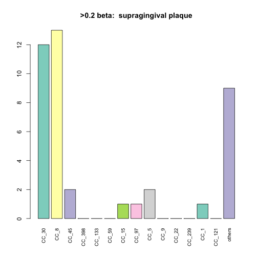
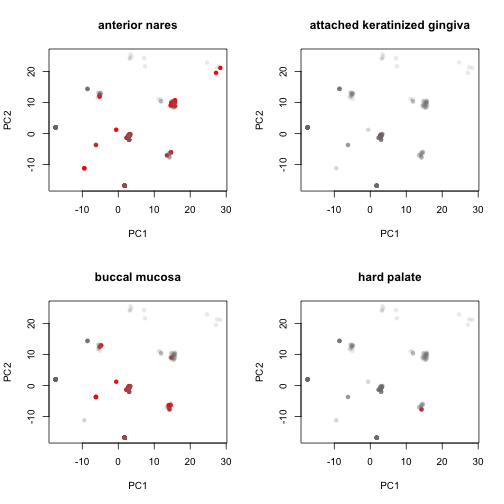
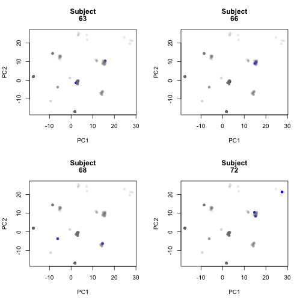

Starting form the filtered table from 'HMP_coverage.Rmd'.  Run a series of analysis to look at relationships between body site and subjects.


```r
library(reshape2)
#library(igraph)
library(dplyr)
```

```
## 
## Attaching package: 'dplyr'
```

```
## The following objects are masked from 'package:stats':
## 
##     filter, lag
```

```
## The following objects are masked from 'package:base':
## 
##     intersect, setdiff, setequal, union
```

```r
#library(biomod2)
library(e1071)
library(RColorBrewer)
library(gdata)
```

```
## gdata: read.xls support for 'XLS' (Excel 97-2004) files ENABLED.
```

```
## 
```

```
## gdata: read.xls support for 'XLSX' (Excel 2007+) files ENABLED.
```

```
## 
## Attaching package: 'gdata'
```

```
## The following objects are masked from 'package:dplyr':
## 
##     combine, first, last
```

```
## The following object is masked from 'package:stats':
## 
##     nobs
```

```
## The following object is masked from 'package:utils':
## 
##     object.size
```

```r
library(vegan)
```

```
## Loading required package: permute
```

```
## Loading required package: lattice
```

```
## This is vegan 2.3-4
```

```r
library(assertthat)
source('./staph_metagenome_tools.R')
```

###Read in data file created in earlier pipeline


```r
dat4 <- read.table("./Data/combined")
```

###Create data files

```r
#list of all subjects with more than one sample
multiSubjects <- count(dat4,Subject.Id) %>% filter(n > 1) %>% select(Subject.Id ) 
dat5 <- make_subtype_matrix(dat4)
#create Hamming dist matrices with and without cutof  min value of 0.2
dat6 <- make_subtype_matrix(dat4) %>% bintr(0.2) %>% hamming.distance %>% data.frame 
dat8 <- make_subtype_matrix(dat4) %>% hamming.distance %>% data.frame 
```
#Subtype abundance

```r
colSums(dat5 > 0.2) %>% sort
```

```
##   CC_49  CC_123   CC_78  CC_239  CC_522 CC_1021   CC_22  CC_130  CC_425 
##       0       0       1       1       1       1       2       2       2 
## CC_2361   CC_50   CC_80  CC_151 CC_2198   CC_20  CC_291  CC_779    CC_1 
##       2       3       3       4       4       5       5       5       6 
##    CC_9  CC_700   CC_75  CC_121   CC_93   CC_72   CC_15   CC_97   CC_59 
##       7       7       8      11      12      13      15      15      19 
##  CC_133    CC_5  CC_398   CC_45    CC_8   CC_30 
##      22      26      29      32      85     114
```

### Permanova

test for significant associations of subtype with with bodysite and subject.  us e Hamming dist. matrix. Two levels, one with a beta cutoff for all samples > 0.2 and one without

```r
set.seed(344098)
run_bs_subj_adonis(dat6,dat4$Body.site,dat4$Subject.Id)
```

```
## 
## Call:
## adonis(formula = df ~ bs_vec) 
## 
## Permutation: free
## Number of permutations: 999
## 
## Terms added sequentially (first to last)
## 
##            Df SumsOfSqs MeanSqs F.Model      R2 Pr(>F)    
## bs_vec     13    110.44  8.4954  2.8258 0.10183  0.001 ***
## Residuals 324    974.08  3.0064         0.89817           
## Total     337   1084.52                 1.00000           
## ---
## Signif. codes:  0 '***' 0.001 '**' 0.01 '*' 0.05 '.' 0.1 ' ' 1
## 
## 	Homogeneity of multivariate dispersions
## 
## Call: betadisper(d = dist(df), group = bs_vec)
## 
## No. of Positive Eigenvalues: 31
## No. of Negative Eigenvalues: 0
## 
## Average distance to median:
##               anterior nares attached keratinized gingiva 
##                       14.688                       11.000 
##                buccal mucosa                  hard palate 
##                       14.114                        0.000 
##   left retroauricular crease              palatine tonsil 
##                       15.495                       12.993 
##            posterior fornnix      right antecubital fossa 
##                        9.541                        0.000 
##  right retroauricular crease                       saliva 
##                       18.616                       11.000 
##                        stool           subgingival_plaque 
##                       10.511                        0.000 
##         supragingival plaque                tongue dorsum 
##                       13.941                       16.605 
## 
## Eigenvalues for PCoA axes:
##     PCoA1     PCoA2     PCoA3     PCoA4     PCoA5     PCoA6     PCoA7 
## 39935.280 33411.675  8375.808  3584.580  2402.131  1977.298  1496.539 
##     PCoA8 
##  1172.550 
##            Df    Sum Sq   Mean Sq        F N.Perm Pr(>F)
## Groups     13  1935.529 148.88685 4.419177    999  0.001
## Residuals 324 10915.909  33.69108       NA     NA     NA
## 
## Call:
## adonis(formula = df ~ subj_vec) 
## 
## Permutation: free
## Number of permutations: 999
## 
## Terms added sequentially (first to last)
## 
##            Df SumsOfSqs MeanSqs F.Model      R2 Pr(>F)  
## subj_vec    1     10.22 10.2202  3.1965 0.00942  0.013 *
## Residuals 336   1074.30  3.1973         0.99058         
## Total     337   1084.52                 1.00000         
## ---
## Signif. codes:  0 '***' 0.001 '**' 0.01 '*' 0.05 '.' 0.1 ' ' 1
## 
## 	Homogeneity of multivariate dispersions
## 
## Call: betadisper(d = dist(df), group = subj_vec)
## 
## No. of Positive Eigenvalues: 31
## No. of Negative Eigenvalues: 0
## 
## Average distance to median:
##         1         2         3         4         5         6         7 
## 9.192e+00 8.246e+00 0.000e+00 0.000e+00 0.000e+00 0.000e+00 9.592e+00 
##         8         9        10        11        12        13        14 
## 2.598e+00 1.019e+01 2.378e+01 1.192e+01 1.553e+01 1.323e+01 0.000e+00 
##        15        16        17        18        19        20        21 
## 1.736e+01 0.000e+00 0.000e+00 1.082e+01 2.182e+01 0.000e+00 9.192e+00 
##        22        23        24        25        26        27        28 
## 1.185e+01 0.000e+00 0.000e+00 1.488e+01 6.801e+00 1.181e+01 1.325e+01 
##        29        30        31        32        33        34        35 
## 1.041e+01 9.823e+00 9.192e+00 1.599e+01 1.496e+01 1.192e+01 1.276e+01 
##        36        37        38        39        40        41        42 
## 0.000e+00 1.647e+01 4.899e+00 1.529e+01 1.607e+01 1.367e+01 1.059e+01 
##        43        44        45        46        47        48        49 
## 1.142e+01 6.360e+00 0.000e+00 0.000e+00 0.000e+00 9.068e+00 0.000e+00 
##        50        51        52        53        54        55        56 
## 0.000e+00 0.000e+00 6.191e-14 0.000e+00 0.000e+00 1.454e+01 1.753e+01 
##        57        58        59        60        61        62        63 
## 1.140e+01 0.000e+00 0.000e+00 1.533e+01 0.000e+00 0.000e+00 1.268e+01 
##        64        65        66        67        68        69        70 
## 0.000e+00 1.360e+01 1.111e+01 4.372e+00 1.401e+01 1.425e+01 1.071e+01 
##        71        72        73        74        75        76        77 
## 8.124e+00 1.722e+01 1.641e+01 9.356e+00 6.128e+00 7.865e+00 1.219e+01 
##        78        79        80        81        82        83        84 
## 8.581e+00 2.089e-14 1.106e+01 1.527e+01 7.802e-14 7.080e-14 2.398e+00 
##        85        86        87        88        89        90        91 
## 0.000e+00 1.117e+01 1.360e+01 0.000e+00 0.000e+00 1.675e+01 1.153e+01 
##        92        93        94        95        96        97        98 
## 1.168e+01 1.267e+01 1.904e+01 1.579e+01 0.000e+00 1.244e+01 0.000e+00 
##        99       100       101       102       103       104       105 
## 0.000e+00 1.185e+01 0.000e+00 1.051e+01 1.133e+01 0.000e+00 0.000e+00 
##       106       107       108       109       110 
## 1.023e+01 9.434e+00 1.360e+01 0.000e+00 9.192e+00 
## 
## Eigenvalues for PCoA axes:
##     PCoA1     PCoA2     PCoA3     PCoA4     PCoA5     PCoA6     PCoA7 
## 39935.280 33411.675  8375.808  3584.580  2402.131  1977.298  1496.539 
##     PCoA8 
##  1172.550 
##            Df   Sum Sq  Mean Sq        F N.Perm Pr(>F)
## Groups    109 10431.06 95.69783 1.175101    999  0.169
## Residuals 228 18567.85 81.43794       NA     NA     NA
## 
## Call:
## adonis(formula = df ~ bs_vec + subj_vec) 
## 
## Permutation: free
## Number of permutations: 999
## 
## Terms added sequentially (first to last)
## 
##            Df SumsOfSqs MeanSqs F.Model      R2 Pr(>F)    
## bs_vec     13    110.44  8.4954  2.8485 0.10183  0.001 ***
## subj_vec    1     10.76 10.7560  3.6064 0.00992  0.007 ** 
## Residuals 323    963.32  2.9824         0.88825           
## Total     337   1084.52                 1.00000           
## ---
## Signif. codes:  0 '***' 0.001 '**' 0.01 '*' 0.05 '.' 0.1 ' ' 1
```

```r
run_bs_subj_adonis(dat8,dat4$Body.site,dat4$Subject.Id)
```

```
## 
## Call:
## adonis(formula = df ~ bs_vec) 
## 
## Permutation: free
## Number of permutations: 999
## 
## Terms added sequentially (first to last)
## 
##            Df SumsOfSqs MeanSqs F.Model      R2 Pr(>F)   
## bs_vec     13    1120.9  86.224  2.8332 0.10207  0.003 **
## Residuals 324    9860.4  30.433         0.89793          
## Total     337   10981.3                 1.00000          
## ---
## Signif. codes:  0 '***' 0.001 '**' 0.01 '*' 0.05 '.' 0.1 ' ' 1
## 
## 	Homogeneity of multivariate dispersions
## 
## Call: betadisper(d = dist(df), group = bs_vec)
## 
## No. of Positive Eigenvalues: 282
## No. of Negative Eigenvalues: 0
## 
## Average distance to median:
##               anterior nares attached keratinized gingiva 
##                       56.978                       13.780 
##                buccal mucosa                  hard palate 
##                       15.675                        0.000 
##   left retroauricular crease              palatine tonsil 
##                       37.359                       19.485 
##            posterior fornnix      right antecubital fossa 
##                       11.345                        0.000 
##  right retroauricular crease                       saliva 
##                       31.598                        7.399 
##                        stool           subgingival_plaque 
##                       20.502                        0.000 
##         supragingival plaque                tongue dorsum 
##                       15.901                       25.472 
## 
## Eigenvalues for PCoA axes:
##      PCoA1      PCoA2      PCoA3      PCoA4      PCoA5      PCoA6 
## 966744.971  22354.124  13576.021   6982.936   4181.425   3460.193 
##      PCoA7      PCoA8 
##   3028.311   2294.600 
##            Df    Sum Sq  Mean Sq        F N.Perm Pr(>F)
## Groups     13  88700.89 6823.146 4.760698    999  0.024
## Residuals 324 464364.52 1433.224       NA     NA     NA
## 
## Call:
## adonis(formula = df ~ subj_vec) 
## 
## Permutation: free
## Number of permutations: 999
## 
## Terms added sequentially (first to last)
## 
##            Df SumsOfSqs MeanSqs F.Model     R2 Pr(>F)
## subj_vec    1       7.7   7.707 0.23597 0.0007  0.998
## Residuals 336   10973.6  32.660         0.9993       
## Total     337   10981.3                 1.0000       
## 
## 	Homogeneity of multivariate dispersions
## 
## Call: betadisper(d = dist(df), group = subj_vec)
## 
## No. of Positive Eigenvalues: 282
## No. of Negative Eigenvalues: 0
## 
## Average distance to median:
##         1         2         3         4         5         6         7 
## 1.584e+01 2.550e+01 0.000e+00 0.000e+00 0.000e+00 0.000e+00 6.260e+01 
##         8         9        10        11        12        13        14 
## 8.431e+01 2.540e+01 5.027e+01 2.249e+01 5.550e+01 6.396e+01 0.000e+00 
##        15        16        17        18        19        20        21 
## 2.809e+01 0.000e+00 0.000e+00 4.620e+01 2.406e+01 0.000e+00 1.155e+01 
##        22        23        24        25        26        27        28 
## 1.038e+01 0.000e+00 0.000e+00 4.139e+01 1.479e+01 3.228e+01 2.820e+01 
##        29        30        31        32        33        34        35 
## 1.989e+01 2.865e+01 1.926e+02 3.429e+01 1.793e+01 9.779e+01 4.010e+01 
##        36        37        38        39        40        41        42 
## 0.000e+00 5.586e+01 3.411e+01 4.218e+01 2.506e+01 3.355e+01 5.787e+01 
##        43        44        45        46        47        48        49 
## 1.365e+02 7.700e+01 0.000e+00 0.000e+00 0.000e+00 6.083e+00 0.000e+00 
##        50        51        52        53        54        55        56 
## 0.000e+00 0.000e+00 4.674e+01 0.000e+00 0.000e+00 2.872e+01 2.950e+01 
##        57        58        59        60        61        62        63 
## 3.074e+01 0.000e+00 0.000e+00 2.083e+01 0.000e+00 0.000e+00 3.074e+01 
##        64        65        66        67        68        69        70 
## 0.000e+00 1.722e+01 1.836e+01 4.050e+01 1.314e+01 1.485e+01 1.936e+01 
##        71        72        73        74        75        76        77 
## 1.854e+01 2.002e+01 2.231e+01 1.815e+01 1.534e+01 2.393e+01 1.652e+01 
##        78        79        80        81        82        83        84 
## 8.371e+00 1.696e+01 1.555e+01 2.101e+01 2.158e-12 3.569e-12 2.266e+01 
##        85        86        87        88        89        90        91 
## 0.000e+00 1.857e+01 9.124e+00 0.000e+00 0.000e+00 1.152e+01 1.033e+01 
##        92        93        94        95        96        97        98 
## 3.842e+01 1.106e+01 2.371e+01 1.649e+01 0.000e+00 5.621e+01 0.000e+00 
##        99       100       101       102       103       104       105 
## 0.000e+00 1.417e+01 0.000e+00 2.184e+01 1.256e+01 0.000e+00 0.000e+00 
##       106       107       108       109       110 
## 2.342e+01 1.077e+01 9.124e+00 0.000e+00 1.560e+01 
## 
## Eigenvalues for PCoA axes:
##      PCoA1      PCoA2      PCoA3      PCoA4      PCoA5      PCoA6 
## 966744.971  22354.124  13576.021   6982.936   4181.425   3460.193 
##      PCoA7      PCoA8 
##   3028.311   2294.600 
##            Df   Sum Sq  Mean Sq        F N.Perm Pr(>F)
## Groups    109 212405.8 1948.677 1.248473    999  0.222
## Residuals 228 355873.4 1560.848       NA     NA     NA
## 
## Call:
## adonis(formula = df ~ bs_vec + subj_vec) 
## 
## Permutation: free
## Number of permutations: 999
## 
## Terms added sequentially (first to last)
## 
##            Df SumsOfSqs MeanSqs F.Model      R2 Pr(>F)   
## bs_vec     13    1120.9  86.224 2.82777 0.10207  0.003 **
## subj_vec    1      11.6  11.588 0.38002 0.00106  0.994   
## Residuals 323    9848.8  30.492         0.89687          
## Total     337   10981.3                 1.00000          
## ---
## Signif. codes:  0 '***' 0.001 '**' 0.01 '*' 0.05 '.' 0.1 ' ' 1
```
### Permutation tests

```r
#test for whether intra-subject distance greater than intersubject
subject_perm(dat4,multiSubjects,dat6)
```


```
## Score for intraperson hits =  1495 
## [1] "Quartlies for random distribution"
##   0%  25%  50%  75% 100% 
## 1555 1635 1654 1672 1750 
## Empirical p value =  0
```

```r
#now look at the same test between body sites
bs <- levels(dat4$Body.site)
by_factor_perm(bs,dat4,dat6)
```

```
## [1] "anterior nares"
## [1] "Number of samples " "78"                
## [1] "Distribution of random hits"
##   0%  25%  50%  75% 100% 
## 5637 6706 6927 7144 8211 
## [1] 6856
## Empirical p value [1] 0.417
## 
## [1] "attached keratinized gingiva"
## [1] "Number of samples " "4"                 
## [1] "Distribution of random hits"
##   0%  25%  50%  75% 100% 
##    0   12   13   16   27 
## [1] 8
## Empirical p value [1] 0.0514
## 
## [1] "buccal mucosa"
## [1] "Number of samples " "57"                
## [1] "Distribution of random hits"
##   0%  25%  50%  75% 100% 
## 2834 3540 3684 3826 4456 
## [1] 2970
## Empirical p value [1] 4e-04
## 
## Zero samples in  hard palate[1] "left retroauricular crease"
## [1] "Number of samples " "23"                
## [1] "Distribution of random hits"
##   0%  25%  50%  75% 100% 
##  354  546  582  622  788 
## [1] 644
## Empirical p value [1] 0.8618
## 
## [1] "palatine tonsil"
## [1] "Number of samples " "6"                 
## [1] "Distribution of random hits"
##   0%  25%  50%  75% 100% 
##    0   29   34   39   64 
## [1] 36
## Empirical p value [1] 0.613
## 
## [1] "posterior fornnix"
## [1] "Number of samples " "11"                
## [1] "Distribution of random hits"
##   0%  25%  50%  75% 100% 
##   54  114  126  140  200 
## [1] 76
## Empirical p value [1] 0.0034
## 
## Zero samples in  right antecubital fossa[1] "right retroauricular crease"
## [1] "Number of samples " "28"                
## [1] "Distribution of random hits"
##   0%  25%  50%  75% 100% 
##  584  822  873  923 1174 
## [1] 1091
## Empirical p value [1] 0.9978
## 
## Zero samples in  saliva[1] "stool"
## [1] "Number of samples " "7"                 
## [1] "Distribution of random hits"
##   0%  25%  50%  75% 100% 
##   12   42   48   54   88 
## [1] 30
## Empirical p value [1] 0.0325
## 
## Zero samples in  subgingival_plaque[1] "supragingival plaque"
## [1] "Number of samples " "37"                
## [1] "Distribution of random hits"
##   0%  25%  50%  75% 100% 
## 1148 1458 1536 1610 1986 
## [1] 1164
## Empirical p value [1] 5e-04
## 
## [1] "tongue dorsum"
## [1] "Number of samples " "82"                
## [1] "Distribution of random hits"
##   0%  25%  50%  75% 100% 
## 6142 7409 7649 7885 8876 
## [1] 7998
## Empirical p value [1] 0.8396
```
### Plots of subtype distribution

```r
presence_mat <- as.data.frame(bintr(dat5,0.2))
top_score_mat <- as.data.frame(bintr(dat5,0.5))
# png("~/Dropbox/ARTICLES_BY_TDR/2015-staph-metagenome/HMP_barchart.png",width=640, height =640, res = 75)
# dev.off()
genotypes_plot(presence_mat,"All CCs, subtypes present > 0.2")
```


```r
genotypes_plot(top_score_mat,"All CCs, subtypes present > 0.5")
```


```r
all_genotypes_plot(presence_mat,"All CCs, subtypes present > 0.2")
```


```r
all_genotypes_plot(top_score_mat,"All CCs, subtypes present > 0.5")
```


```r
for (i in bs) {
  bss_rows <- which(dat4$Body.site == i)
  if(length(bss_rows) > 0) {
    bs_df <- slice(presence_mat,bss_rows)
    genotypes_plot(bs_df,paste(">0.2 beta: ", i))
  }
}
```



```r
for (i in bs) {
  bss_rows <- which(dat4$Body.site == i)
  if(length(bss_rows) > 0) {
    bs_df <- slice(top_score_mat,bss_rows)
    genotypes_plot(bs_df,paste(">0.5 beta: ", i))
  }
}
```


### PCA

```r
par(mfrow=c(2,2))
pcobj <- prcomp(dat6)
tr_gray <- rgb(0.5,.5,.5,.15)

for (i in bs) {
  prcols <- rep(tr_gray,nrow(dat6))
  prcols[which(dat4$Body.site == i)] <- "red"
  plot(pcobj$x,col = prcols, pch = 16, main = i)
}
```



```r
for (i in multiSubjects$Subject.Id) {
  sub_rows = which(dat4$Subject.Id == as.character(i))
  if (length(sub_rows) > 3){
    prcols <- rep(tr_gray,nrow(dat6))
    prcols[sub_rows] <- "blue"
    plot(pcobj$x,col = prcols, pch = 16, main = c("Subject",i))
  }
}
```


### Session Info

```r
sessionInfo()
```

```
## R version 3.2.3 (2015-12-10)
## Platform: x86_64-apple-darwin13.4.0 (64-bit)
## Running under: OS X 10.11.3 (El Capitan)
## 
## locale:
## [1] en_US.UTF-8/en_US.UTF-8/en_US.UTF-8/C/en_US.UTF-8/en_US.UTF-8
## 
## attached base packages:
## [1] stats     graphics  grDevices utils     datasets  base     
## 
## other attached packages:
##  [1] assertthat_0.1     vegan_2.3-4        lattice_0.20-33   
##  [4] permute_0.9-0      gdata_2.17.0       RColorBrewer_1.1-2
##  [7] e1071_1.6-7        dplyr_0.4.3        reshape2_1.4.1    
## [10] knitr_1.12.3      
## 
## loaded via a namespace (and not attached):
##  [1] Rcpp_0.12.3     cluster_2.0.3   magrittr_1.5    MASS_7.3-45    
##  [5] R6_2.1.2        stringr_1.0.0   plyr_1.8.3      tools_3.2.3    
##  [9] parallel_3.2.3  grid_3.2.3      nlme_3.1-125    mgcv_1.8-11    
## [13] DBI_0.3.1       class_7.3-14    gtools_3.5.0    lazyeval_0.1.10
## [17] Matrix_1.2-3    formatR_1.2.1   evaluate_0.8    stringi_1.0-1  
## [21] methods_3.2.3
```

